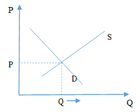

# 市場行爲

面對時刻變化的金融市場，我們該如何迅速地地分析與理解這些市場行爲呢？供給需求模型是一個良好的分析工具。

在市場中，買者作爲一個羣體決定了一種產品的需求，賣者作爲一種羣體決定了一種產品的供給。供給需求模型由需求曲線和供給曲線組成，需求曲線描繪出一種物品價格對消費者想購買的物品量的影響，供給曲線描繪出一種物品價格對生產者想生產的物品量的影響。

需求定理表明，在其他條件不變時，一種物品的價格上升，對該物品的需求量減少，因而需求曲線通常向下傾斜。同樣地，供給定理使供給曲線通常向上傾斜。

供給需求與需求曲線相交於一點，在這一點上，市場達到均衡，交點處的價格稱爲均衡價格，交點處的數量稱爲均衡數量。此時，市場有效地組織了經濟活動。

這一模型的合理性就在於模型本身簡單明瞭，同時能夠在很大程度上反應出市場的大部份有效的信息(如供給定律和需求定律)。

當一些新的信息進入這個市場的時候，往往會打破原先的均衡，爲了研究這些信息將會導致市場均衡如何變動，我們首先需要將這些信息進行分類，這樣便能夠迅速對均衡價格與均衡數量進行方向性的判斷和預期，我們將這些信息對於供需模型的影響分爲四個類型：

均衡價格上升的情形：

1. 需求上升
  * 寒冬增加了人們對於保暖用具的需求.
2. 供給下降
	* 超預期霜凍天氣造成了農作物的減產.

均衡價格下降的情形：

1. 供給上升
	* 央行下調準備金率釋放流動性，貨幣供應增加.
2. 需求下降
  * 技術革新造成原有產品需求疲軟.

上述四個類型均可用供需模型進行解釋，由需求上升引起的均衡價格上升最終表現爲量價齊升的態勢，而由供給下降導致的均衡價格上升最終表現爲價升量縮，同樣均衡價格下降的情形也可以利用供給模型一一推導。

##案例討論 中國房地產市場
###前言

本案例將結合經濟學原理，帶領大家理解中國房地產市場。

###正文

在1998年以前，中國房地產市場實行住房收入分配制度，也就是所謂的職工分房，隨著1998年國務院正式宣佈停止住房收入分配，中國房地產市場正式邁入市場化階段。各地陸續停止福利分房，房價開始攀升。到了2005年，房價加速上揚，據國家統計局統計，當年一季度全國房價上漲19.1%，住房成交量與成交金額均達到歷史性高點。

###問題
1、之前的福利分房政策相當於政府對房地產市場增加了怎樣的干預？與自由市場相比，這樣的干預會導致哪些結果？當時的社會狀況和經濟資料中有沒有對這些結果的支持？

相當於限價政策，導致城市建設進展緩慢

2、2005年樓市的量價齊升說明了什麼？ （需求、供給曲線的移動）

需求上升

3、簡述房地產市場的繁榮對中國經濟的影響？為什麼社會上抱怨高房價的聲音很多？

房地產市場量價齊升有助該行業迅速發展，並帶動上下游產業的發展，提升中國經濟的總體增長水準。由於消費者、生產者剩餘的增加推升社會總福利，但價格上漲擠出了中低收入者。

 
	
2005年3月26日，首個針對房地產調控的政策《關於切實穩定住房價格的通知》("國八條")清晰傳達了對房價上漲過快的憂慮。"保證中小套型住房供應"、"打擊炒地"、"期房禁止轉讓"，成為此次房地產新政的關鍵字。

2005年6月1日起，對個人購買住房不足2年轉手交易的，銷售時按其取得的售房收入全額徵收營業稅；個人購買普通住房超過2年(含2年)轉手交易的，銷售時免征營業稅；對個人購買非普通住房超過2年(含2年)轉手交易的，銷售時按其售房收入減去購買房屋的價款後的差額徵收營業稅。

2006年4月28日，央行全面上調各檔次貸款利率0.27個百分點，其中，5年期以上的銀行房貸基準利率由6.12%上調至6.39%。這是央行在加息後短短一年多時間裡再次上調利率，此次加息主要是為了抑制投資需求，進一步穩定房地產價格。

###問題

4、政府調控的內在邏輯是什麼？（稅收、供給需求關係、貨幣政策）

提高投機者的成本，抑制投機性需求
5、期房的出現說明了什麼？（短期、長期彈性）
住房供給短期缺乏彈性，長期富有彈性
6、請用直覺解釋為什麼是這樣？請指明如何區分住房短期需求和長期需求？並用圖像解釋為何這種現象表明了住房短期供給缺乏彈性而長期供給富有彈性？

2007年，小產權房開始興起，成為社會關注的熱點。小產權房是指在農村集體土地上建設的房屋，未繳納土地出讓金等費用，其產權證不是由國家房管部門頒發，而是由鄉政府或村政府頒發，亦稱“鄉產權房”。“小產權房”不是法律概念，是人們在社會實踐中形成的一種約定俗成的稱謂。該類房沒有國家發放的土地使用證和預售許可證，購房合同在國土房管局不會給予備案。所謂產權證亦不是真正合法有效的產權證。

2007年7月，"小產權房"被全面叫停。按照國家的相關要求，“小產權房”不得確權發證，不受法律保護。

###問題

7、小產權房火熱的原因是什麼？（替代品）

由於房地產市場的火爆，類似小產權房的替代品需求也隨之上升。

2008年中國樓市出現了短暫拐點，全國商品房銷售面積6.2億平方米，同比下降19.7%，其中，商品住宅銷售面積下降20.3%。與此同時，銷售均價僅同比下降了0.3%

###問題

8、如果導致這輪房價下滑的主要原因是需求下降，請問需求彈性和供給彈性哪個更大？

供給彈性更大

9、如果主要原因是供給增加呢？

需求彈性更大

10、你認為主要原因是哪一個？

需求下降，因為量價齊跌

2009年，為了完成當年保八目標，政府決定刺激房地產市場。

###問題

11、如果你是政府，你將制定怎樣的政策？

與之前的政策相反即可。

隨著房地產政策的放鬆以及適度寬鬆貨幣政策的刺激，房價出現了快速回升，很快就突破了2008年的高點，2009年全國一手商品房住宅平均價格上升25.1%，為中國自1998年進行住房體制改革依賴房價升幅最大的一年。針對這一現象，2010年，國務院分別於1月10日、4月17日、9月29日先後出臺了三次重大調控政策，收緊二套房貸（首付不低於50%，利率不低於基準利率1.1倍），並對二套房收取更高的契稅。與此同時，住房限購令在全國範圍內展開，不少地區更是提出了限價令。

###問題

12、收緊二套房貸、住房限購令抑制了哪部分需求？

投機性需求，這與之前的政策思路一致。

13、圖解限價令對房地產市場的影響

然而嚴厲的房地產調控政策並沒有取得太大成效，房價在經歷了短暫調整後重拾上升態勢，2010年全國商品房銷售均價上漲7.2%，銷售面積上漲10.1%，2011年再上漲6.8%，2012年再上漲8.1%。

###問題
14、這說明了什麼問題？結合這一現象評述之前房地產調控的思路？有什麼好的解決方案

剛性需求是需求主力。這也從之前需求相對缺乏彈性的分析中有所體現，前段時間以抑制投機性需求的調控思路收效甚微。新增供給，如土地出讓、保障房建設等。

15、如果導致這輪房價上漲的主要原因是需求上升，請問需求彈性和供給彈性哪個更大？

供給彈性更大

16、如果主要原因是供給減少呢？

需求彈性更大

17、你認為主要原因是哪一個？

需求上升，因為量價齊升

從2010年開始，政府加強了保障性住房的建設，其中2010年計畫完工300萬套，2011年1000萬套，2012年500萬套，2013年470萬套。保障房的建設在一定程度上滿足了中低收入者的住房需求，但也造成了一系列的社會問題，諸如保障房暗箱分配，內部作假等腐敗情況時有發生。經濟學家茅于軾在接受媒體採訪時稱，“廉租房應該是沒有廁所的，只有公共廁所，這樣的房子有錢人不喜歡。”他事後還解釋，自己的觀點絕不是在“為富人說話”，恰恰是出於對社會上最困難人群的關心。

###問題

18、保障房的建設是以何種方式調控房價的？

政府補貼

19、如果保障房的用地來自於商品房，最後房價是否會下降？如何評價這一政策？

由於之前提到供給彈性很大，均衡價格僅會輕微下降

20、茅于軾關於廉租房評論的內在邏輯？

利用降低服務品質篩選不符合要求的人群

進入2014年，房地產市場拐點隱現，杭州多個樓盤頻繁降價，引發了杭州乃至浙江對樓市的擔憂。種種跡象顯示，開發商集體看空樓市既是基於對市場危機的認知，同時也希望以此來獲得政府對宏觀調控政策的改變。據有關資訊顯示，杭州有關方面已多次召開由多家開發商參與的溝通會，有意放鬆樓市限購。

3月20日，開元房產旗下樓盤開元名郡宣佈降價，降價幅度在10%到20%之間。在此之前，杭州多個樓盤已啟動了通過降價回籠資金的舉措。隨後，更多的杭州樓盤加入了降價行列。天鴻•香榭裡從均價17200元/平方米降至13800元，陽光郡從均價17500元/平方米降至13800元，運河協安藍郡從16800元/平方米降至14400元。此外，協安紫郡、保利梧桐雨、天陽半島國際、萬科北宸之光都有不同程度的降價。

資料顯示，2014年第一季度，杭州主城區商品房成交套數5276套，創了近三年來同期成交套數新低，還不到去年同比的50%。

3月25日，杭州市政府召開房地產企業座談會。杭州市市長張鴻銘在會上強調，杭州正處於新型城市化發展的關鍵階段，房地產行業事關杭州轉型發展大局，要保持房地產市場穩定健康持續發展，要防範“系統性風險”。

###問題

21、請解釋上文中提到的房地產市場“系統性風險”

結合開篇提到的，房地產市場聯動上下產業，是一個龐大的系統。

22、地方政府為什麼對於房地產市場動向如此敏感？

分稅制

23、價格下降10%-20%但銷量下滑了50%說明了什麼問題？

房地產市場需求大幅下降

24、*前文中提到2010年前後房地產需求中剛性需求是主力，此處又提到2014年房地產市場需求大幅下降，請解釋背後的邏輯。你如何細分房地產的需求結構（比如前文提到的剛性需求，投資需求），這些細分需求各自的特點是什麼（在總體中所占比重，彈性大小等）
