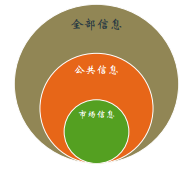

# 主要假設及其合理性

## 完美市場
在第一章中曾經提到，競爭性是維護市場長期存在的重要力量。完美的市場除了要求商品交換的同質性，更重要的是對於信息要求達到完全的透明，即交易之間無信息不對稱。

在完美的市場下，資源以均衡價格被分配，均衡價格等於邊際成本，銷售者不會有超額利潤產生。現實情況下，完美市場的條件幾乎不可能實現，因而出現了現實生活中難以用此解釋的市場現象和市場行爲。

## 有效市場

在尤金·法马(Eugene Fama)於1970年在《American Finance Association》發表的《EFFICIENT CAPITAL MARKETS: A REVIEW OF THEORY AND EMPIRICAL WORK》中對有效市場進行了如下定義：

> A market in which prices always "fully reflect" available information is called "efficient."
>
>當一個市場中價格總是能夠充分反映所有可得信息，這個市場便被稱爲是有效的。

有效市場並不一定是完美的市場，它表明資源即使在有信息不對稱的情況下，依然能夠實現有效配置。

在尤金·法马的論述中，有效市場有三個基本假設：

1. 投資者的理性，他們追求最大利潤
2. 信息的隨機性，市場的一致預期是無偏的
3. 反應的迅速、準確性，市場將立即準確地反應新信息，資產價格達到新均衡。

上述假設在一定條件下可以放寬。如果市場存在非理性者，他們可能因力量較小無法改變均衡價格。即使力量總和很大，如果他們的交易決策獨立則對市場的影響將相互抵消。即使他們的交易決策有很高的相關性，市場上強有力套利者就會進行大量套利交易維持當前均衡價格。

在有效市場中，一切價格的變動只能由信息的變化來解釋，無法由投資者的投資決策來解釋。

如果存在長期獲得超額收益的方法，市場無效，有效市場的三個基本假設至少有一個不能滿足。

信息在市場中扮演了重要的角色，根據類型可以將信息分爲：

1. **全部信息**：已公開的和未公開的所有信息。
2. **公共信息**：已公開的所有信息，包括成交價、成交量、公司狀況、宏觀環境等。
3. **市場信息**：證券價格信息，包括證券的成交價、成交量、賣空金額、融資金額等。

以上三類信息存在包含關係，公共信息包括所有市場信息，全部信息包含所有公共信息，如下圖所示：

按照信息表述方式分類可分爲：**實證表述信息**和**規範表述信息**。實證表述信息描述了世界是什麼，規範表述信息描述了世界應該是什麼。

在有效市場下，規範信息是冗餘信息。這一點可以通過反證法證明，如果規範信息不是冗餘信息，那麼這個規範信息一定提供了新的信息，但規範信息是建立在現存的所有信息之上的，而有效市場假定無法通過對已有信息的處理獲得更多的信息，矛盾。這告訴我們要做好研究，就要多找實證信息。
