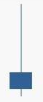

# 技術面分析

技術面分析是僅從證券的市場行爲來分析證券價格未來變化趨勢的方法。其中市場行爲包括價格、成交量以及價量的時間序列等。

技術面分析是基於弱有效市場不成立的假設下認爲，可以通過對於市場信息的處理戰勝市場。

技術面分析的三個主要假設：

1. 包容假設：市場行爲包含一切信息。
  * 這一假設認爲，基本面信息對市場供求產生的影響已經充分反映在市場價格和成交量當中，在一般情況下，技術面分析可以代替基本面分析。
2. 慣性假設：價格沿趨勢波動
  * 需要說明的是，這裏的趨勢指的價格的波動模式，當然單邊勢也是屬於波動模式的一種，但不是全部。技術面分析即利用價格波動的模式預測未來的價格。
3. 重複假設：歷史會重複
  * 俗話說「江山易改，本性難移」，上述假設的合理性在於，人的行爲模型在很多情況下不受人的主觀能動性的控制，因而會有重複性的市場行爲出現。

## 趨勢理論

利用慣性假設，根據價格波動的規律，通過假設趨勢繼續延續的方法，運用騎乘趨勢的方法預測價格，當然如果發生趨勢轉變的時候需要止損。

最爲顯然的一種慣性假設即後一個交易日的漲跌幅與前一個交易日的漲跌幅正相關，換言之，這可以通過股票價格時間序列的分析進行驗證。以上證指數爲例，在早年階段其走勢具有明顯的慣性，從近幾年的數據來看慣性已經明顯減弱，在統計意義上不顯著。

最近5575個交易日

(表格暫缺)

最近2579個交易日

(表格暫缺)

最近1579個交易日

(表格暫缺)

最近579個交易日

(表格暫缺)

## 形態理論

利用重複假設，通過尋找歷史走勢中相似的形態，運用歷史形態之後的價格走勢預測當前形態之後的價格走勢。

最簡單的形態理論即爲K線理論，即通過尋找歷史市場信息中相近的K線或K線組合，運用在它們之後的價格表現來預測當前K線狀態下的價格表現。以單個K線形態陰線「射擊之星」爲例，射擊之星的含義爲價格呈現衝高回落的態勢，K線具有明顯的上引線，用量化語言表述爲：

1. 收盤價 < 開盤價
2. (最高價 - 開盤價) > 2 * (開盤價 - 收盤價)
3. 開盤價 – 收盤價 > 收盤價 – 最低價

通過對2010.1.1 – 2013年12月31日的A股數據進行回測，我們發現符合上述條件的30479個案例第二個交易日的期望收益爲 -0.1952%，因而射擊之星經常被看作是趨勢反轉的信號。

## 技術指標

技術指標分析的方法，即應用一定的數學公式，對原始數據進行處理，得出指標值，將指標值繪成圖標，從定量的角度對股市進行預測的方法。

技術指標分爲以下幾個類別：

1. 趨勢型指標：移動平均線（MA），指數平滑異同平均線（MACD）
2. 超買超賣型指標：威廉指標（WMS），隨機指標（KDJ），相對強弱指標（RSI），乖離率指標（BIAS）
3. 人氣型指標：心理線指標（PSY），能量潮指標（OBV）

從本質而言，運用技術指標的本質是挖掘價格的趨勢並預測趨勢的改變。以移動平均線爲例，資產價格在移動平均線之上波動可以被認爲是上升趨勢，一旦價格下破移動平均線則說明上升趨勢逆轉。其操作策略與回測的思想即，在移動平均線之上選擇持有，下破移動平均線進行賣出操作。

不同的技術指標在預測趨勢方面特性不同，例如長期的移動平均線和MACD在預測大趨勢方面準確性較高，但反應速度較慢，適合於波動較爲緩慢的股票市場，而短期的移動平均線和KDJ反應速度迅速但準確性一般，適合於運用在商品期貨以及外匯市場。

## 案例討論：量價關係

## 案例討論：曲線移動和沿曲線移動

## 案例討論：淺談回撤理論
