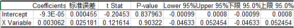

# 技術面分析

技術面分析是僅從證券的市場行爲來分析證券價格未來變化趨勢的方法。其中市場行爲包括價格、成交量以及價量的時間序列等。

技術面分析是基於弱有效市場不成立的假設下認爲，可以通過對於市場信息的處理戰勝市場。

技術面分析的三個主要假設：

1. 包容假設：市場行爲包含一切信息。
  * 這一假設認爲，基本面信息對市場供求產生的影響已經充分反映在市場價格和成交量當中，在一般情況下，技術面分析可以代替基本面分析。
2. 慣性假設：價格沿趨勢波動
  * 需要說明的是，這裏的趨勢指的價格的波動模式，當然單邊勢也是屬於波動模式的一種，但不是全部。技術面分析即利用價格波動的模式預測未來的價格。
3. 重複假設：歷史會重複
  * 俗話說「江山易改，本性難移」，上述假設的合理性在於，人的行爲模型在很多情況下不受人的主觀能動性的控制，因而會有重複性的市場行爲出現。

## 趨勢理論

利用慣性假設，根據價格波動的規律，通過假設趨勢繼續延續的方法，運用騎乘趨勢的方法預測價格，當然如果發生趨勢轉變的時候需要止損。

最爲顯然的一種慣性假設即後一個交易日的漲跌幅與前一個交易日的漲跌幅正相關，換言之，這可以通過股票價格時間序列的分析進行驗證。以上證指數爲例，在早年階段其走勢具有明顯的慣性，從近幾年的數據來看慣性已經明顯減弱，在統計意義上不顯著。

最近5575個交易日

最近2579個交易日

最近1579個交易日

最近579個交易日

## 形態理論

利用重複假設，通過尋找歷史走勢中相似的形態，運用歷史形態之後的價格走勢預測當前形態之後的價格走勢。

最簡單的形態理論即爲K線理論，即通過尋找歷史市場信息中相近的K線或K線組合，運用在它們之後的價格表現來預測當前K線狀態下的價格表現。以單個K線形態陰線「射擊之星」爲例，射擊之星的含義爲價格呈現衝高回落的態勢，K線具有明顯的上引線，用量化語言表述爲：

1. 收盤價 < 開盤價
2. (最高價 - 開盤價) > 2 * (開盤價 - 收盤價)
3. 開盤價 – 收盤價 > 收盤價 – 最低價

通過對2010.1.1 – 2013年12月31日的A股數據進行回測，我們發現符合上述條件的30,479個案例第二個交易日的期望收益爲 -0.1952%，因而射擊之星經常被看作是趨勢反轉的信號。

## 技術指標

技術指標分析的方法，即應用一定的數學公式，對原始數據進行處理，得出指標值，將指標值繪成圖標，從定量的角度對股市進行預測的方法。

技術指標分爲以下幾個類別：

1. **趨勢型指標**：移動平均線(MA)，指數平滑異同平均線(MACD)，布林軌道線(BOLL)
2. **超買超賣型指標**：威廉指標(WMS)，隨機指標(KDJ)，相對強弱指標(RSI)，乖離率指標(BIAS)
3. **人氣型指標**：心理線指標(PSY)，能量潮指標(OBV)

從本質而言，運用技術指標的本質是挖掘價格的趨勢並預測趨勢的改變。以移動平均線爲例，資產價格在移動平均線之上波動可以被認爲是上升趨勢，一旦價格下破移動平均線則說明上升趨勢逆轉。其操作策略與回測的思想即，在移動平均線之上選擇持有，下破移動平均線進行賣出操作。

不同的技術指標在預測趨勢方面特性不同，例如長期的移動平均線和MACD在預測大趨勢方面準確性較高，但反應速度較慢，適合於波動較爲緩慢的股票市場，而短期的移動平均線和KDJ反應速度迅速但準確性一般，適合於運用在商品期貨以及外匯市場。

如多個不同技術指標同時發出相同的信號則正確率較高，如存在量能的配合則有效性更高。

###簡單移動平均線(SMA)

簡單移動平均線計算指定數日收盤價的平均值，反映一段時間內平均的持倉成本。其計算公式爲：

	SMA(n) = 最近n日收盤價之和 / n
	n通常取5, 10, 20, 30, 60, 120, 250
	n取值較小爲短期平均線，n取值較大爲長期平均線。 
	指標靈敏度與n取值呈負相關，正確率與n取值呈正相關。

在使用時通常將最新收盤價與SMA(n)進行比較，如收盤價高於SMA(n)則代表上升趨勢，如收盤價低於SMA(n)則代表下跌趨勢，如果收盤價上穿或下破SMA(n)則相應級別的趨勢可能發生逆轉。

	當價格回調至SMA(n)附近時
	短期平均線從下往上穿越長期平均線稱爲黃金交叉，此爲確定上升趨勢的開始，可進行買入操作。
	短期平均線從上往下穿越長期平均線稱爲死亡交叉，此爲確定下跌趨勢的開始，可進行賣出操作。
	多條均線粘連時，市場沒有趨勢，一旦突破震盪區間則維持趨勢的動力很強。

SMA(n)反映平均持倉成本，該指標適用於強趨勢型行情，例如在資金推動型的股票市場和債券市場中使用將獲得較高的正確率。而在震盪行情中，多條均線粘連狀態下難以進行有效的判斷。

###布林軌道線(BOLL)

布林軌道是由移動平均線變化而來，並經過改良移動平均線通道上下限的計算方法，以標準差的計算方法，從而令上下限的波幅跟隨市況波動程度而改變。其計算公式爲：

	中軌 = 上一交易日的MA
	上軌 = 中軌 + 2 * MD
	下軌 = 中軌 - 2 * MD
	其中MA爲過去n日平均收盤價格，MD爲過去n交易日收盤價標準差。
	n通常取10 

布林軌道線反映市場狀況的超買或超賣狀況，令投資者對市況提高警覺。在圖標中以三條曲線顯示，從上至下依次稱爲上軌、中軌和下軌。

	當價格升至上軌時爲賣出信號，價格將受阻回落。如果價格升破上軌則說明趨勢轉強，需止損。
	當價格跌至下軌時爲買入信號，價格將企穩回升。如果價格跌破下軌則說明趨勢轉弱，需止損。
	若價格第二次上衝上軌或下探下軌受阻則趨勢隨時發生逆轉。
	當布林軌道明線收窄時，市場無趨勢區間震盪，等待方向性選擇。

該技術指標的有效性依賴與趨勢期間價格變動速率的一致性，認爲價格的過快變動將會回歸到正常趨勢中，並不能適應波動率迅速變化的市場。該指標在原生品市場的有效性高於其在衍生品市場的有效性。

該技術指標隱含的價格波動短期內呈正態分佈的假設使其在無法應對價格肥尾分佈以及非連續變化。

###相對強弱指標(RSI)

相對強弱指數是一項領先的動量指標，反映一段時間內上升平均幅度與下跌平均幅度的比率。其計算方式爲：

	RSI(n) ＝ A / (A＋B) × 100%
	其中A表示n天中價格上升時漲幅的總和，而B则價格下跌時跌幅的總和。
	n通常取14，也可取9或25。
	指標靈敏度與n取值呈負相關，正確率與n取值呈正相關。
	0 <= RSI(n) <= 100，RSI高代表升勢，RSI低代表跌勢。

這一比率類的指標有效排除了絕對波動率的干擾，適用範圍較廣。其具體的使用方法爲：

	當RSI升至70時，市場進入超買區，當升至80以上則進入了極度超買區。
	當RSI跌至30時，市場進入超賣區，當跌至20以下則進入了極度超賣區。
	超賣超賣現象發生時，趨勢逆轉的可能性較大。
	當RSI與價格走勢發生背離現象時，趨勢逆轉的可能性很大。

該指標適用於弱趨勢震盪行情，趨勢形成通常較爲脆弱容易逆轉，在外匯市場和貴金屬市場的短期分鐘線使用較爲有效。不適用於強趨勢型行情，RSI的逆轉預測作用錯誤率很高，即使出現極度超買超賣或多次背離也無法準確預測轉折點，因而在國債市場和股票市場的常週期分時中使用較少。

## 案例討論：量價關係

在對成交量是否增加以及價格是否上升進行枚舉分類可以得到四個不同的類別：

###放量上升

根據供給需求模型，價量齊升通常體現了需求的提升

產生於2010年10月的上升行情便是一個經典的放量上升的案例，當月上證指數上升了12.18%，資料顯示，隨著經濟資料回暖，僅十月初資金流入超過200億元。
 

###縮量上升

不同于供給增加，縮量上升反映的主要是需求端的變動，由供給需求模型可以看出，供給的減少導致了縮量上升的結果。

在莊股時代中，由於籌碼大部分集中在莊家手中，在他們還沒有出貨之前，股價通常呈現縮量上升的態勢。

 
還有一個典型的案例便是發生在2011年4月，當時指數連創新高但是成交量卻一直萎靡不振，為後市的下跌埋下了伏筆。

###放量下跌

由供給增加帶來的結果是放量下跌，這與由需求上升帶來的結果截然相反。

2013年錢荒即是由供給增加導致的放量下跌。

 
###縮量下跌

這一現象，也就是大家經常聽到的陰跌，是由需求減少造成的。這一現象的產生按時了供給壓力的減緩，即可能是由於出售方希望等待下一個出貨良機的暫時性減緩拋售，其後往往伴隨著又一輪的放量下跌，也可能是由於價格過低導致供給方的惜售，價格的下跌僅是由於需求不足造成。而如果在經歷了一段事

滬深股市在過去的幾年中除了2010年雙十一的暴跌、2011年美債危機以及2013年年中的錢荒等幾次事件出現了放量下跌的現象外，其餘情況多以縮量下跌為主，顯示出A股市場需求，即資金面的嚴重緊張，可能也在一定程度上導致了小市值股票的繁榮。
 
## 案例討論：曲線移動和沿曲線移動

在供給需求模型中，供給方或者需求方的曲線移動都將導致最終市場均衡點沿著曲線的移動。這裡需要明確的是曲線移動和沿曲線移動的區別。

曲線移動代表的是激勵的改變，是一種主動的改變，亦即在每個價格水準上，供給或者需求的改變。例如，由利比亞戰爭導致的石油減產是一種主動的，在每一個價格水準上供給量都下降的供給減少。

沿曲線移動並沒有激勵變化，是一種被動的改變，是因為另一方曲線的移動導致的市場均衡點的變化。例如，2008年石油暴跌引起沙烏地阿拉伯的石油減產就是一種被動的，沿著曲線移動的供給量減少。

與此同時，我們需要認識到，在有效市場中，曲線移動帶來的沿曲線移動的過程是暫態的，這也就導致了價格在新消息發佈之後的跳變。然而在並非有效的市場中，上述過程是逐漸進行的，這也是技術分析中所言“價格沿趨勢波動”的原因之一。

## 案例討論：淺談回撤理論

在資本市場中我們經常會看到如下技術分析：“某品種目前觸及**回撤位，預計在此位置將會有較大支撐/壓力，建議買入/賣出”。然而目前對於回撤理論的有效性探討較少，本文將從均衡的角度出發，尋找回撤位背後的理論支持。
回撤位即某一品種的價格在經過一波上漲或下跌之後，產生反方向的調整後達到的位置，x-回撤位即價格回吐了前期漲跌幅的x，（例如0.5-回撤位就是價格回吐了前期漲跌幅的一半）。簡單起見，我們僅討論上升之後的回撤。
在這裡用到的一個重要的測定指標為籌碼成本，亦即在價格波動過程中價格加權成交量的平均值，例如當價格大於籌碼成本且價格上升的時候，新增的成交將會提高籌碼成本。

###一、
情景假設：在價格波動的過程中，成交量恒定且籌碼僅在上升的過程中堆積，即當價格從k漲至k + 1時，籌碼成本分佈服從U(k, k + 1)
均衡條件：價格達到x-回撤位時，盈利籌碼數量= 虧損籌碼數量
方程：x = 1 – x 解得：x = 0.5

###二、
情景假設：在價格波動的過程中，成交量恒定，籌碼在上升和下降途中都會堆積，即當價格從k漲至k + 1，隨後價格又跌至了k + x，那麼(k + x, k + 1)的分佈密度是(k, k + x)的2倍
均衡條件：價格達到x-回撤位時，盈利籌碼數量= 虧損籌碼數量
方程：x = 2 * (1 – x) 解得：x = 2 / 3 = 0.67

###三、
情景假設：在價格波動的過程中，成交量相對價格有正相關性，假設價格從k漲至k + 1，隨後價格又跌至了k + x，那麼(k + x, k + 1)的分佈密度是(k, k + x)的3倍
方程：x = 3 * (1 – x) 解得：x = 3 / 4 = 0.75

###四、
情景假設：在價格波動的過程中，成交量恒定，籌碼在上升和下降途中都會堆積，當價格到達x-回撤位時，盈利籌碼占x，平均單位盈利x / 2， 虧損籌碼占(1 – x) * 2，平均單位虧損(1 – x) / 2
均衡條件：價格達到x-回撤位時，淨盈利金額= 0，即盈利金額= 虧損金額
方程： x * x / 2 = (1 – x) * 2 * (1 – x) / 2 解得： x = 2 – sqrt(2) = 0.59

###五、
情景假設：在價格波動的過程中，成交量恒定，籌碼在上升和下降途中都會堆積，同時利用艾略特波浪理論對時間週期的假設，回探到回撤位的時間長度= 從起點上升到回撤位的長度，也就是說在回撤過程的籌碼堆積量為x。此時盈利籌碼占x，平均單位盈利x / 2，虧損籌碼占(1 – x + x)，平均單位虧損(1 – x) / 2
均衡條件：價格達到x-回撤位時，淨盈利金額= 0，即盈利金額= 虧損金額
方程：x * x / 2 = 1 * (1 – x) / 2 解得：x = (sqrt(5) – 1) /2 = 0.618

###均衡條件的合理性
1、根據行為金融學的研究成果，人對過去的資訊十分在意，即使它們獨立于未來的資訊，在意自己的初始建倉成本(sunk cost effect)就是一個普遍的現象，這樣籌碼的數量和成本分佈將會在短期內對價格產生影響。而市場籌碼平均成本即代表了整個市場的建倉成本，在數量或金額上的盈虧均衡點上將會達到多空平衡。

2、艾略特波浪理論的時間週期：回探到回撤位的時間長度= 從起點上升到回撤位的長度，這一假設可以理解為價格回檔需要消化前期的獲利籌碼的過程，在成交量恒定的情況下，消化所有獲利籌碼需要相同的時間週期，當獲利籌碼消化完畢後即會產生趨勢改變動力。

###回撤幅度的一些性質
可以看到，如果頂部量能較大則回撤幅度相對有限，但達到回撤位後反彈的難度較大，而如果頂部籌碼堆積較輕，則可能出現較大幅度回撤，不過隨後反彈的空間也較大。
注：上述結論的得出依賴諸多假設，在實際運用過程中，需要充分利用成交量等市場訊息，對籌碼的分佈情況進行動態調整，利用均衡條件獲得更為精確的回撤位置。
