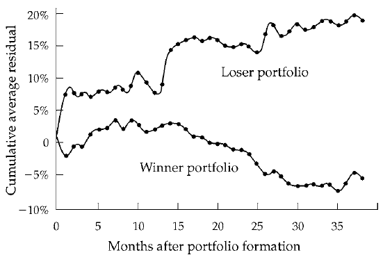
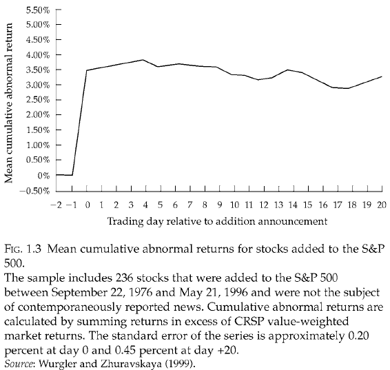
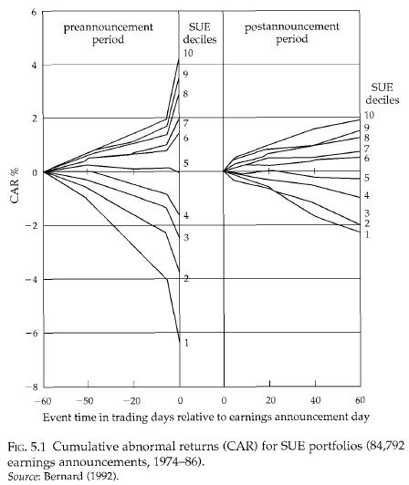
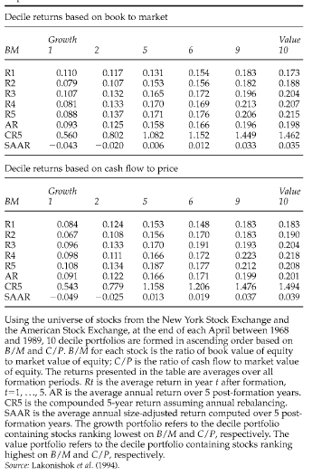
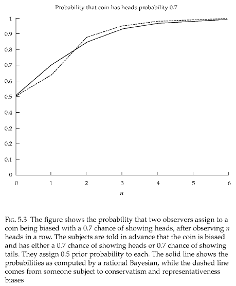

# 行爲金融學

## 行爲金融學提出背景
在有效市場假說提出的20年後，有效市場假說的理論基礎和實證檢驗證據都受到了挑戰。保持有效市場的關鍵力量：套利行爲遠比這一理論的提出者想象的脆弱和有限從目前的理論發展看，兩條線索互相競爭，互相促進，共同發展，基於信息不完全、不對稱和一般均衡理論的模型在解釋金融市場異常方面有明顯不足；但行爲金融還不能有效地應用於金融產品定價，並且現有理論模型本身缺乏廣泛的經驗證據支持。

## 理論方面

EMH基於三個逐漸放鬆的假定之上，共同點是，至少套利者是理性的，他們有能力保持市場的有效。Samuelson在1965年的研究和Mandelbrot在1966年的研究指出在一個由理性風險中性投資者組成的競爭市場中，因爲證券的基本價值和價格是遵循隨機遊走規律的，所以收益是不可知的。因而在遵循隨即遊走的情形下，要獲得經過風險調整後的超額收益是不可能的。爲了獲得超額利潤，投資者必須承擔風險，所以這些超額利潤是對承擔風險的合理報酬。

然而將一般大衆，特別是投資者假定爲一直是完全理性，很難令人信服。Fischer Black在1986年的研究表明投資者依據的是噪音而非信息。

**很多跡象表明，投資者的行爲在絕大多數情況下並非符合經濟理性最大化的假定。**

投資者並不看重他們最終獲得財富的絕對水平，而更關注對於某一參照標準來說他們得與失的量，並且這一標準會因時因地而不斷變化。

人會盡可能避免遭受損失，Kahneman和Tversky在1979年提出的前景理論表明投資者虧損函數的斜率比獲利函數大，Odean在1998的研究表明投資者爲了避免損失，在股票套牢時不願意止損賣出。

Mehra和Prescott在1985以及Benartzi和Thaler在1995 年關於股權溢價之謎的闡述表明投資者不願意廣泛地持有股票。

Kahneman和Tversky在1973的研究表明，對不確定性後果進行預期時，個人的行事原則常常會違反貝葉斯原則和概率最大化理論。人們在思考時遵循啓發式思維方式，經常會用短期的歷史數據來預測不確定的未來，並試圖找出這些過去發生的事情的表徵意義有多大。當過分相信這些事件的表徵意義時，他們往往忽視這些近期事件的發生僅僅是偶然發生、而非符合他們建立的“模型”的事實。投資者可能會把一些公司近期盈利快速增長的短暫歷史擴展到未來，從而過度超高那些熱門股的股價，但同時他們忘記了從統計上說樹再高也高不過天的道理。

對一個既定問題每個人的選擇不同是因爲該問題呈現給他們的表現方式不同，由此每個人也就用不同方法去解決問題。例如投資人不僅僅只是觀察到短期股票收益的波動，而是發現投資於股票的長期收益相對高於投資於債券的話，他們就會將財產投向股票。

**還有跡象表明，人們並不只是偶然偏離理性，而且經常以同樣的方式偏離，他們買賣行爲之間有很大的相關性。**

與此相關的最經典的社會現象即是羊羣效應，Scharfstein和Stein在1990年的研究表明，代理人存在業績壓力，他們選擇其他經理人買進的組合，以免落在別人後邊，給人留下無能的印象。因而他們人爲地在投資組合中增加近期表現不錯的股票，拋出那些表現欠佳者。

**有效市場的維持依賴於套利者，然而現實中的套利不僅充滿風險，而且作用有限。**首先套利者們不可能找到完全相同的替代品，與此同時價格偏差在消失前會繼續錯下去。

### 實證方面

許多研究成果都對有效市場假說產生了的挑戰。有效市場假說表明價格能夠快速、準確地反映信息，這在弱式有效市場中首先遇到了挑戰。De Bondt和Thaler在1985年對股票價格的長期趨勢進行了分析，他們將前三年表現最好和最差的公司編組，看他們此後五年投資與兩種組合所得到的收益情況。這個情況很難用風險的差異來解釋（CAPM），可能的原因時投資者的過度反應。

Jegadeesh和Titman在1993年對於股票價格的短期趨勢進行了分析，並建立了動量理論：單隻股票過去6-12個月的股價走勢有助於預測同方向未來的價額走勢。

類似的挑戰在半強式有效市場更爲明顯。

小公司股票收益率明顯大於大公司股票，市值排名前10%的股票在歷史上的平均收益率爲9.84%，顯著低於市值排名後10%股票的平均收益率13.83%，小公司股票還有明顯的1月效應，即它們1月份收益平均比大公司高4.8%，不過這一效應在過去15年中消失了。

Fama和French在1992年的研究以及Lakonishok等人在1994年的研究表明，市賬率高的公司與低的公司相比，收益要相對低得多，而且前者的市場風險比後者高，這一現象在世道不好、經濟衰退的時候表現得更爲突出。

有效市場假說表明，價格在消息真空時無趨勢性波動，1987年的黑色星期一強力地反駁了這一點。Cutler 等人在1991研究了戰後美國股市單日波動最大50家公司股價變化，許多沒有明顯的消息變化。Wurgler和Zhuravskaya在1999年的研究表明股票納入標普500實際上使平均股價升高了3.5%，這種現象非暫時，隨着指數基金對這類股票持有比重的相對提高，增幅在增大。

## 行爲金融學內容與理念

行爲金融學研究的是，在競爭性市場中，人爲什麼做出錯誤決策，但它也不是簡單地分析一些人爲什麼會犯傻、會迷惘、會有偏見。搞清楚人爲什麼會有偏見與迷惘的本質特徵難度很大，也是個見仁見智的問題。行爲金融理論試圖跳出這種爭論，而把人會犯錯、會迷惘、帶有偏見引入到競爭性金融市場分析中，因爲在這一市場中至少還有一些套利者是完全理性的。然後去考察當不同類型的投資者相互交易時，價格和其他顯示市場業績的信號會發生怎樣的變化。有效市場僅是一些極端情況下才出現的情形，在現實環境中這種情形不可能存在。

行爲金融學有兩個理論基礎：

1. 因替代品、流動性的侷限導致的有限套利，使得需求在無信息時仍會變化。
2. 投資者心態分析，即投資者在現實世界中買賣證券市場如何形成投資理念和對證券進行判斷的。

## 目前的一些研究結論和投資策略思考

### 金融市場中噪音交易者的風險

模型假設：

1. 跨期代際結構（套利者考慮問題的時間跨度越長，他們的交易越主動，市場越有效）。
2. 風險資產的供給量不變（供給量的增加，諸如股權置換，新股增發等都會使得對套利者更爲有利）。
3. 噪音交易者的風險是系統性風險（本質上沒有任何關係的證券，在受到同樣噪音交易者心態變化影響時，也會出現同樣變動的特點）。

結論：金融市場中的噪音交易者將會：

1. 引起風險資產的價格波動。
2. 引起風險資產價格對基本價值的偏離。
3. 除非對由噪音交易者看淡未來而引起的風險資產價格下跌所形成的風險得到補償，套利者將不會持有風險資產（下期噪音交易者心理的不確定性使得從本質方面來看並無風險的資產u變得充滿風險）。

如果噪音交易者的證券組合主要集中於受噪音交易者風險影響的資產，他們平均的投資收益可能比套利者相對要高。（噪音交易者因爲較多地承受了自己帶來的高風險而獲得了比套利者更高的風險補償，儘管是他們扭曲了價格）。

然而我們不能做噪音交易者，原因如下：

1. 儘管有時候噪音交易者獲得的平均收益相對較高，但他們的平均效用水平卻較低，但因爲金融影響力來自於財富而非效用，因而噪音交易者對市場影響力較大，儘管由於收益的不穩定性，他們未必如我們所看到的那麼幸福。
2. 預期收益率不等於長期生存能力。噪音交易者收益波動較大，從長期看多數情況下獲得的財富較低。

現實生活中的情況對套利者而言更爲糟糕：

1. 賣空機制通常限制了套利者尋找合適的替代品，有時會將空頭擠出。
2. 套利者並不知道投資者心態模型。
3. 交易成本增加了套利者的成本。

### 基於上一個模型的現實生活中的例子——封閉式基金折價之謎

不同於開放式基金，封閉式基金髮行的基金髮行的基金份額數量固定，這些基金份額可在證券市場中轉讓交易，投資者如果想將手中持有的基金份額提前與基金到期日前變現，他只能將其持有的份額賣給其他投資者，而不能像開放式基金那樣按每份基金的淨資產現值（NAV）要求被贖回。

與上一個模型的關聯：這裏的封閉式基金就近似於風險資產（雖然本質上是無風險資產），而封閉式基金所持有的資產就近似於無風險資產。

結論：

1. 封閉式基金常年以10%-20%的比例貼水轉讓。
2. Weiss在1989年的研究和 Peavy在1990年的研究表明，發起人最初向投資人募集封閉式基金並用其購買證券之時，其溢價的幅度大約爲10%
3. Weiss在1989年的研究表明，在 120天后交易價格逐漸以平均大於10%的貼水比例銷售。
4. 貼水幅度在不同時期有很大的不同。
5. Brauer在1984年以及Brickley和Schallheim在1985年的研究表明臨近到期日貼水顯著變小。

### 投資者心態模型

* 反應不足：正確價格對於公司盈利公告之類的信息反應遲鈍（動量現象）。
* 反應過度：在大概3-5年的較長時期中，證券價格會對一直指向同一方向的信息變化有強烈的過度反應。

上述現象的解釋：

1. 表徵性思維方法（反應過度）：人們在看待某一類事件時常常忽略這一過程中事件發生的概率分佈規律而把一些代表性事件或典型性事件看作試驗的趨勢（人們在實際上是隨機排列的時間順序中發現了規律）。
2. 守舊性（反應不足）：人們在面對新的證據時是逐漸調整自己的認知方式的。

實證檢驗：（橫截面數據）

反應不足：投資與該公司股票的平均收益在好消息公佈後的一段時間內比壞消息公佈後的同樣時段獲利要多。Bernard在1992年依據宣佈的公司盈利信息包含意外的大小分成10組，標準化的意外盈利（某公司在某個給定季度的盈利與1年前同樣季度盈利的差值經公司盈利的標準偏差平均換算而成）在組成資產組合的60個交易日內，由最高SUE組成的股票組合獲得的經過風險調整後的累計收益比由最低SUE組成的股票組合高出4.2%

反應過度：隨着一系列而不是一條利好消息的發佈，證券平均收益低於一連串利空消息發佈後的平均收益的現象。De Bondt和Thaler在1987年的研究，Fama和French在1992年的研究以及 Lakonishok等人在1994年的研究表明，相對於資產和公司盈利價值被高估的各種股票，往往是那些在過去幾年盈利高速增長的公司股票，在未來獲得的風險調整收益反而相對較低，而那些被低估的股票卻反而會有高的風險調整收益。從下表可以看出，不論按賬面值/市值的比率還是安現金收入流量/價格比率來測算，每年按十分位數分組的有投資價值的股票與熱門股票的收益最大相差8-10%

Edwards在1968年開創性地研究了人的守舊性，個人能按正確方向更新他已落後的思維，但相對於理性貝葉斯標準有些差距。在對公司後續盈利形成新的估計時，投資者未能合理地整合新的公司盈利數據和自己已有的信息，相對於那些形成個人先前思維觀念的證據，他們常常會低估那些有用的統計數據。Tversky和Kanneman在1974年的研究顯示人的表徵性啓發式的思維方法，人會按以下幾個方面來判斷不確定事件和樣本：（1）樣本與母體總體在本質特徵上的相似度（2）樣本產生過程對顯著特徵的反應程度。

例如，我們會將他喜歡運動（樣本符合好運動員的特徵）認識爲他喜歡運動而且他是一個很好的與動員。
一個人被告知硬幣實際出現的結果是正面的概率爲70%，在職過n此後出現的總是正面，下圖爲人知過程：

正反饋投資策略分析解釋了在信息真空情況下的動量源，亦即價格沿趨勢波動的原因。噪音交易者在價格泡沫階段只對價格過去的變化感興趣，而對其他消息的反應非常麻木，他們的行爲在交易中存在着正反饋交易行爲，即在價格升高時買進證券，在價格下跌時賣出證券。Black在1988年的研究表明在財富水平提高時，投資者願意承擔更大的風險。而套利者對未來噪音交易者的需求變化並無任何特別的信息優勢當正反饋現象存在時，理性套利者只會使市場變得更不穩定。他們對有效性沒有強烈的信念

## 案例討論 趨勢的來源——以比特幣爲例

比特幣作為一種新興的、機具前景的虛擬貨幣，正逐漸進入人們的眼球，隨著比特幣交易量的逐漸攀升，運用統計套利的可行性也逐漸增強，我們以技術分析為例：

回顧技術分析的三大假設：

1.市場行為包含一切

2.市場價格沿趨勢變化

3.歷史會重演

利用價格的趨勢性的基本理念或者說最容易想到的一個想法就是看一看今天的收益率與昨天的收益率，或者說t時刻的收益率與t-1時刻的收益率有沒有相關性，經過一系列的回歸，筆者驚訝的發現，比特幣的價格居然存在著十分穩固的負相關性！

過去100000筆交易

過去200000筆交易

過去300000筆交易

 

這一反直覺的現象令筆者疑惑，為此我又收集上證指數的所有歷史價格資訊進行回歸分析，這一次與我們的直覺較相符：

最近5575個交易日

最近2579個交易日

最近1579個交易日

最近579個交易日
  

可以看到，隨著莊股時代的落幕，散戶時代的告別，價格的趨勢性正在逐漸減弱，以至於最終t時刻的價格與t-1時刻的價格幾乎沒有相關性了。

最後談一談比特幣價格具有負相關性的原因，個人認為比特幣作為一種虛擬貨幣，參與者以技術大牛居多，因此存在著大量的自動化交易（與筆者這幾天看盤下來的感受比較符合），而這些自動化交易大多想當然地運用了價格的趨勢性，所以價格波動非常劇烈，一旦出現某個趨勢性型號就會有一大堆自動單出現，這導致了價格時刻處在過度反應與糾正的過程中，t時刻與t-1時刻的負相關性也就很大程度上歸因於是自動交易的產物了。

## 歷史上的泡沫事件

在歷史上，諸多泡沫事件具有共同的特徵與發展過程，如下表所示：

1. 重大利好消息產生
2. 套利者開始同時增加可得到的實物資產和相應的股權證明（設計新品種增加供給）
3. 權威機構的吹捧適當價格達到極致時支撐泡沫
4. 泡沫破滅

<table>
  <tr>
    <th>泡沫名稱</th>
    <th>啓動</th>
    <th>掌握內情者的反應</th>
    <th>泡沫的維持</th>
    <th>權威機構的吹捧</th>
    <th>泡沫破滅</th>
    <th>政治上的反響</th>
  </tr>
  <tr>
      <td>荷蘭鬱金香泡沫（17世紀50年嗲）</td>
      <td>花葉病毒導致鬱金香異常豔麗，荷蘭沸騰</td>
      <td>選育鬱金香；由於只能無性繁殖且生長緩慢，內部人購進鬱金香花枝</td>
      <td>開發出對鬱金香投機的合約，可在公證前簽字；交易出現</td>
      <td></td>
      <td>1637年</td>
      <td></td>
  </tr>
  <tr>
      <td>南海泡沫（1710-1720年）</td>
      <td>兌換政府債券獲利，被認爲壟斷了與西班牙在美洲殖民地的貿易</td>
      <td>內部人士預先買進可轉換債務的指標，隨後全額兌出獲利</td>
      <td>建立咖啡館連鎖網點用於投機買賣，簽訂新協議</td>
      <td>政府介入，皇室參與</td>
      <td>1720年</td>
      <td>事後處罰組織者；限制採用公司制形式</td>
  </tr>
  <tr>
      <td>密西西比泡沫（1717-1720年）</td>
      <td>對新世界貿易快速增加，勞（Law）作爲一名融資組織者的成功</td>
      <td>勞德賺錢計劃和有權對法國債務證券化</td>
      <td>政府支持；勞的銀行大量放貸支持進一步購買</td>
      <td>官方支持，奧爾良逮捕了批評勞德人，如巴黎和其他議會的首領</td>
      <td>1720年</td>
      <td>勞垮臺，法國金融改革的努力讓步知道1787年重新開始</td>
  </tr>
  <tr>
      <td>英國第1次鐵路風潮（1845-1846年）</td>
      <td>蕭條結束；新的運輸方式前景看好</td>
      <td>規劃了許多鐵路</td>
      <td>喬治˙哈德遜的龐氏騙局（運用鐵路公司的資本支付最新的紅利）</td>
      <td>國會通過法案統一政府提出的鐵路建設的每一個方案；喬治˙哈德遜與倫敦社會各界良好的關係</td>
      <td>沒有崩潰、逐漸降溫</td>
      <td>改革會計標準；要求只能用盈利支付紅利，而不能用資本金</td>
  </tr>
  <tr>
      <td>美國1873年鐵路熱潮與崩潰</td>
      <td>內戰結束；美國政府開發西部</td>
      <td>政府對鐵路建設予以補貼</td>
      <td>增加鐵路建設特許證書；預期補貼將會持續</td>
      <td>亨利˙瓦娜姆˙普爾和查爾斯˙弗朗西斯˙亞當斯</td>
      <td>1873年喬伊庫克公司破產；19世紀70年代中期蕭條開始</td>
      <td></td>
  </tr>
  <tr>
      <td>阿根廷貸款熱（19世紀80年代）</td>
      <td>世界市場對阿根廷大宗農產品需求旺盛；早期投資者獲利豐厚</td>
      <td>投資從英國流向阿根廷</td>
      <td>在倫敦證交所發行新證券；創立合股公司開發阿根廷土地</td>
      <td>阿總統對巴恩斯公司勢態表示出的樂觀態度（希望不出現破產）總體上誤導了國外投資者</td>
      <td>巴恩斯公司在1890年破產</td>
      <td>軍事政變；對國外資本歧視的法規出臺</td>
  </tr>
  <tr>
      <td>20世紀20年代佛羅里達地產熱</td>
      <td>冬季漫長的氣候；人口逐漸集中；20世紀20年代的繁榮</td>
      <td>鐵路的開通；邁阿密的發展；房地產的開發</td>
      <td>開設分公司，建立網絡銷售佛羅里達的土地</td>
      <td>威廉姆森˙基寧˙布萊恩炒熱佛州地產；市長和開發商關係密切</td>
      <td>1926年</td>
      <td>詐騙者被起訴</td>
  </tr>
  <tr>
      <td>20世紀20年代美國股市泡沫</td>
      <td>20世紀20年代經濟快速增長；第一次世界大戰後通貨緊縮</td>
      <td>大量發行股票；創立新的封閉式基金</td>
      <td>地區性交易所建立；抵押貸款和經紀人貸款增加</td>
      <td>受到庫利奇、胡佛、梅隆和費雪的吹捧</td>
      <td>1929年10月及以後</td>
      <td>格拉斯-斯蒂格爾法；證監會成立；公共事業控股公司法出籠；羅斯福競選成功</td>
  </tr>
  <tr>
      <td>20世紀20年代公用事業股票熱</td>
      <td>電力需求增加；規模經濟</td>
      <td>高負債操作；擴張規模以獲得規模經濟</td>
      <td>創立公用事業控股公司，採用階梯式管理</td>
      <td></td>
      <td>1929年10月及以後</td>
      <td>大公司階梯，田納西流域管理局建立；對公用事業部門出臺了大量管制措施</td>
  </tr>
  <tr>
      <td>20世紀60年代美國的聯合大企業合併熱</td>
      <td>連續20多年股價的上升，投資於成長股獲利豐厚</td>
      <td>出現了大批專門的聯合大企業；哈羅德˙傑寧的ITT、特克隆公司、特勒尼公司</td>
      <td>股票互換創造出引人注目的盈利</td>
      <td>哈佛大學的捐款在國家學生市場擴展計劃中佔了較大的比重；麥克喬治˙邦迪鼓動機構投資者大膽主動買入股票</td>
      <td>1970-1971年</td>
      <td>改革會計實際操作制度；威廉姆森法出臺</td>
  </tr>
</table>

## 20個行爲金融理論值得研究的問題

### 關於投資者

1. 投資者怎樣理解風險？這一理解與實際生活中的基本風險有何關係？投資者自己的成敗經歷及對投資的構想怎樣影響着基本風險？
2. 投資者如何評估風險？爲什麼他們有時（例如在購買因特網類股票時）會有賭博心理，有時（購買其他股權時）又表現得謹小慎微？對於不同的投資他們內心會有什麼不同嗎（如老虎機式（Poker Chip）賭博和留窩蛋式（Nest Eggs）賭博）
3. 什麼有助於推動人們形成對某種證券投資收益的外推預期（追趕趨勢）模型？泡沫是怎樣開始的？
4. 什麼樣的心理現象支配着投資者購買股票？而當投資者小心謹慎時，又懷着什麼心理？
5. 爲什麼不同的投資者對於什麼是好的投資有不同的模型？爲什麼他們相互之間會進行那麼多交易？

### 關於市場

1. 爲什麼借入證券然後賣空的機制的發展非常落後？爲什麼套利者需要的一些非常關鍵的證券一個也不存在？
2. 套利需要花多長時間才能擺脫超額利潤的慣例？這是由什麼決定的？爲什麼一些異象的持續時間比另外的現象長
3. 用一種投資模式的生命週期是怎麼表現的？它是如何產生、壯大並消失的？是一個單獨的套利者好（因爲機會最好），還是人多勢衆好（因爲人多可以推動價格快速地趨同於基本價值）
4. 推出指數或者準指數在引導着我們什麼？能獲得的指數超額收益到底有多大？如果存在的話，什麼可以消除這些超額收益？
5. “糾正”價格偏差如何介入？關於公司盈利的消息或其他消息是催化劑嗎？或者說存在着一種強大的自我實現機制嗎？藉此可從不起眼消息中推演出背後蘊藏着的重大消息碼？

### 關於實際經濟後果

1. 投資者心態是影響證券發行的核心要素嗎？公司在推銷證券時應該做什麼？通過紅利分配和盈利”管理“如何來改變投資者心態？
2. 如果市場非有效性是存在的，那麼它會造成投資扭曲嗎？價格泡沫是有助於一些無法獲得投資的哈項目獲得融資，還是鼓勵了一些浪費資源項目的開工？
3. 開放市場並使交易進行得更便利，僅僅增加了投機還是顯著改變了套利？什麼時候開放或爲交易提供便利帶來的好處多？什麼時候帶來的弊端多？
4. 在一個國家進行贈券投資組合的好處是什麼？會有什麼成本？
5. 因爲投資選擇不當或被欺騙，投資者在金融市場中經營欠佳後，對他們參與未來交易有什麼影響？

### 關於政策

1. 政府應在什麼時間干預市場、穩定證券價格（如限制匯率、購買證券、停止交易等）？怎麼鼓勵政府在需要時進行干預，而在不需要時不干預？
2. 如何能防止噪音交易（假定噪音交易者應該被打擊）而同時不影響套利者？誰應該調解市場？怎麼調節？
3. 基金理財者們披露消息的方法還要進一步改變嗎？不斷地向市場通告資產組合可取嗎？或者說這一做法會引起好事者的提前擠兌、平倉，甚至股票市場的崩潰嗎？金融中介的透明永遠是好事情，還是會引起金融恐慌？
4. 誰應該在危機中被救助？由誰救助？
5. 對投資者進行教育能克服心理偏見嗎？如果可以，怎麼做？爲什麼沒有幫助私人去除偏見的服務機構存在？
