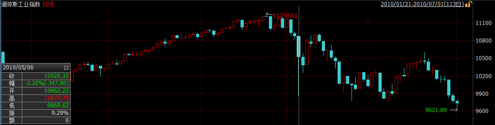
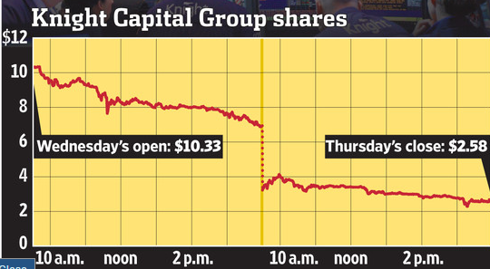
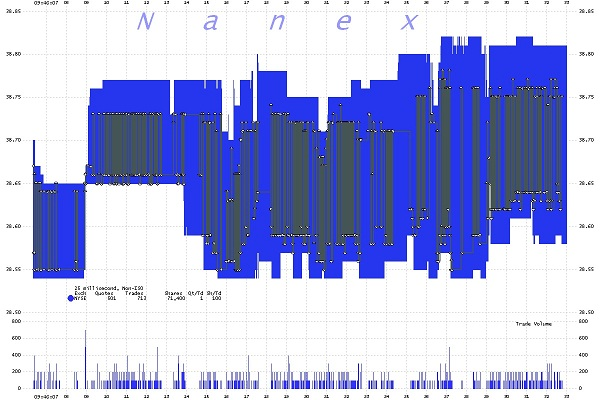
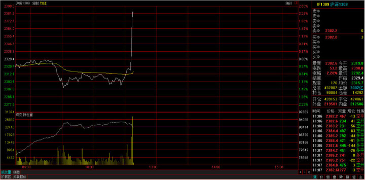
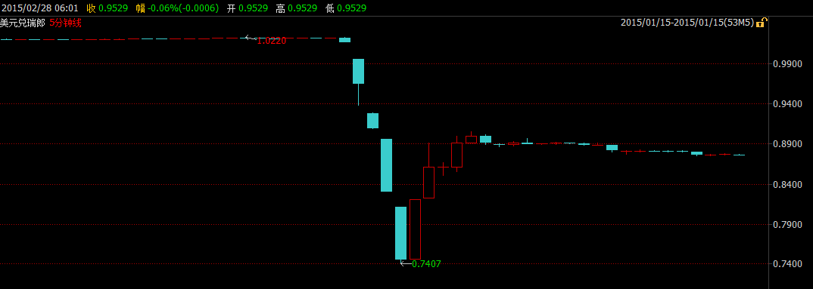

# 免費的午餐？

在這裏我們很有必要討論量化策略的有效性，並檢驗策略的成功是否依賴於小概率事件並未發生，策略能否抵禦極端情況的發生。

## 案例討論：烏龍指&黑天鵝

###日本瑞穗證券“烏龍指”操盤手敲亂日本股市

2005年12月8日，日本瑞穗證券公司的一名經紀人在交易時出現重大操作失誤，引發投資者恐慌並導致證券類股票遭遇重挫，東京證券交易所陷入一片混亂這個錯誤發生在當天上午開盤後不久。瑞穗證券公司一名經紀人接到一位元客戶的委託，要求以61萬日元(約合4.19萬人民幣)的價格賣出1股J-Com公司的股票。然而，這名交易員卻犯了個致命的錯誤，他把指令輸成了以每股1 日元的價格賣出61萬股。

這條錯誤指令在9時30分發出後，J-Com公司的股票價格便快速下跌。等到瑞穗證券公司意識到這一錯誤，55萬股股票的交易手續已經完成。為了挽回錯誤，瑞穗發出了大規模買入的指令，這又帶動J-Com股票出現快速上升，到8日收盤時已經漲到了77。2 萬日元(約合人民幣5.3萬元)。回購股票的行動使瑞穗蒙受了至少270億日元(約合18.5億人民幣)的損失。

此次事件中最冤枉的瑞穗證券公司是啞巴吃黃連，有苦說不出。而遭受損失的還有眾多的散戶，因為當天有不少散戶只聽到了有證券公司出現操作失誤將遭遇大規模虧損的傳言，卻不知道具體是哪家公司，因此只好把證券公司的股票一股腦地拋售，在短短幾個小時內，上市公司的股票被拋售一空。股票持有者生怕自己買的公司就是那個倒楣蛋，也清倉出售。

###海爾認沽現“烏龍指” 股民820元變成56萬

2007年3月8日，南京一股民以1厘錢的價格買到收盤價近0.70元的海爾認沽權證 ，資金瞬間從820元變56萬，一天炒出了700倍的收益！

“說實話我也沒想到真的會成交。”這位股民稱，收盤之後他查了一下自己的帳戶，一下子多出了50多萬。“我想是不是搞錯了？以前也有一次，因為系統出錯，我的帳戶上多出了100多萬。”但是這次張浩仔細看了盤面之後，確信這次50多萬是真的到了自己的帳戶上。“因為今天的盤面上我看到了1厘錢的成交價格。我一共買到82萬份海爾認沽權證。”

1厘錢能買到權證的概率有多大？證券公司專業人士稱，這樣的概率簡直就和中六合彩一樣。“這種情況發生，只有在一種情況下，那就是在9：25分-9：30之間，首先要有人掛出按市價委託的賣單，賣單先進交易所，同時沒有什麼買單。然後，這位股民掛出了1厘錢的買單，買單後進交易所。”以前從來沒有人掛過按市價委託的單子。就這一次機會，就讓他給碰上了。

###Quant Meltdown

2007年8月6日-8月9日，許多歷史上非常成功的量化對沖基金突然出現了大幅虧損，淨值波動幅度遠遠超過歷史平均水準。例如以業績優異著稱的文藝復興公司(Renaissance Technologies Corp)就向投資者報告旗下一隻主要基金8月初損失達8.7%，另外Highbridge的損失為18%，Tykhe的損失為20%，Goldman Global Equity的損失為30%。造成這一現象的重要原因就是當時主流量化模型的類似性。當時股票市場仍處於牛市之中，各家對沖基金基於類似研究成果建立的量化模型都給出了趨同的操作建議，短期內各對沖基金獲利頗豐。但是當時許多對沖基金使用的是相同的協力廠商風險評估模型，根據模型評估結果，對沖基金們又開始實施類似的風險調整。短期內大量類似的交易需求造成了對市場的衝擊，放大了對沖基金的損失。

###美國交易員“烏龍指”按出美股9.11

2010年，彭博通訊社、美國國家廣播公司財經頻道等財經媒體曾報導，根據多個消息來源，在美國東部時間2010年5月6日下午2時47分左右，一名交易員在賣出股票時敲錯了一個字母，將百萬誤打成十億，導致道鐘斯指數突然出現千點的暴跌。2010年美國東部時間5月6日，當天從下午2點42分到2點47分之間，道鐘斯指數從10458點瞬間跌至9869.62點，與前一交易日收盤相比，下跌了998.5點。Accenture的股價被打至每股1分，Apple則升至每股10萬。與此同時，資本市場出現了一系列連鎖反應，E-mini S&P 500 2010年6月指數期貨出現了40億的賣單，高頻交易者接單10分鐘後，由於倉位元管理需要斬倉，這時市場無流動性，更低價錢出手，高頻交易者之間相互倒手，放大交易量和振幅。期現套利者進場，波動傳至股票，ETF，衍生品市場，進而傳遞到整個金融市場。

到2點58分，道指又回到10479.74點。這是道鐘斯指數歷史上第二大單日波幅。

###Facebook IPO

2012年5月18日，Facebook 上市首日由於NASDAQ遇到技術問題，推遲30分鐘開市。當時撮合系統計算速度為40us，由於Facebook上市首日訂單太多，需要花5ms。因為客戶可以更改訂單，這5ms有新的訂單或撤單，交易所撮合系統從頭計算，又產生延遲，客戶再下單改單撤單，造成閉環。推遲30分鐘開盤後，問題又延續了好幾個小時，客戶因無法成交或成交多過報單數損失約1億美金。

同樣的事情發生在BATS，第三大交易所上。2012年3月23日，BATS上市首日程式中的bug把交易代碼寫錯了，造成閉環，股價在900毫秒的時間內從16美元跌至僅幾美分。系統無法識別，無奈BATS停止了交易，並最終取消了IPO。

###騎士資本的高頻交易事故

騎士資本是美國最大的經紀商和做市商之一，2011年它處理了超過10%的美國上市股票交易量，在紐交所和納斯達克交易所零售股票交易業務中排名第一。2012年8月1日一次致命的交易系統故障中它損失4.4億美元，接近破產邊緣，最終被Getco LLC收購。2013年，美國證監會對其處以1200萬美元罰金。

我們都知道交易股票應該低買高賣，起碼正常的交易員都是這麼理解的並且這麼做的，反過來做的話那就是在虧錢。而據Nanex的分析，這正是騎士資本那個瘋狂的交易程式所做的。換句話說，作為做市商角色的騎士資本，其交易程式所發出的報價並非是通過限價交易為市場提供流動性，而更像是市價指令。作為做市商，其通過向市場提供流動性獲益，即設置在買入價和賣出價的限價指令。而騎士資本的交易程式做的完全相反，他實際上在吸收流動性並為此付費，儘管這一流動性導致的是虧損而非收益。

Nanex對紐交所提供的Exelon Corporation（EXC）的交易報告做了分析，通過對這一受影響的股票交易進行研究，展示出騎士資本的“瘋狂”交易程式是如何進行操作的。

1.下圖是是EXC的1秒為間隔的交易圖。圖中的圓圈是發生的交易，藍點是紐交所的買入價和賣出價，這些價格大部分被連接這些交易的灰色線所覆蓋。 

2.下圖是放大後的27秒交易資料。在這張圖裡，連接交易的灰色線更加清楚，紐交所的買入/賣出價是藍色的陰影區域（陰影區的底部是買入價，而頂部是賣出價）。 

3.下圖是放大後1毫秒間隔圖，我們可以看到一秒鐘的資料中包含了39筆交易。注意這些交易是如何從買入價到賣出價之間來回執行的。這就像是一個人在賣出價買入，隨後在10豪秒後又在買入價賣出，並不斷重複。這意味著損失了買入和賣出價之間的溢價。在EXC的案例中，這意味著每筆交易虧損約15美分。該交易每秒執行40次，每分鐘2400次，這顯然是個很有效率的燒錢程式。

正如Nanex所分析的，該程式高買低賣，並不斷重複。而由於騎士資本這一“瘋狂”程式所導致的交易邏輯混亂，當日很多的股票交易都出現了異常，推高了股價，因為在這一程式下，股價越高，該程式就越有動力繼續買入推高股價。這就解釋了為何不僅交易量飆升，而且股價也隨之走高，如中國臍帶血庫（CO）暴漲了數百個百分點。

而值得注意的是，由於這既非誤操作（fat&nbsp;finger)也非一筆交易覆蓋所有報價觸發熔斷機制的錯誤交易程式，而是一個緩慢的有條不紊發生的交易，這並不符合當前SEC的報價取消規則，因此沒有理由取消騎士資本“瘋狂”程式導致的這些交易。

客戶的一個交易單過來，Knight並不一定是直接把交易單直接扔到市場上去交易（尤其是這個交易單比較大的情況）。為了客戶的利益，根據市場流動性情況和交易情況，經紀商可能需要幫助客戶把交易單拆分成小交易單放到市場上去成交。

Knight使用一個叫做SMARS的系統用來做上面這件事情。調查報告中聲稱SMARS系統處理了美國上市股票超過1%的交易量。SMARS有一個叫做「Power Peg」的模組，在2003年被停用。但是這個模組從未被刪除或者停用，而是一直處於待命狀態，只要系統的某一個特殊的參數被設置為「YES」，該模組就會被調用用來交易。

SMARS在將大單拆分成小單分批報送交易所進行成交時，它必須維護一個數：這個大單目前還剩下多少股未處理或在途。每報送一個新小單時，都應該扣減未處理的股票股數。在2005年，Knight移除了Power Peg模組中的這個計數功能。

紐交所將在8月1號啟動一個叫Retail Liquidity Program（簡稱RLP）的項目。（注：這個Retail Liquidity Program的介紹見這裡。我沒看明白它的作用。）

為配合RLP項目的啟動，Knight也更新它的SMARS程式。程式師完成了一個新的RLP模組，RLP專案客戶的交易使用這個RLP模組來執行。這個模組被設計取代之前的「Power Peg」模組。取代後，之前那個特殊的參數被設置為「YES」，意思是使用RLP模組。

但不幸地是，從7月27日Knight開始在它的八台伺服器上部署RLP代碼時，其中七台機器順利安裝，操作人員失誤忘記在第八台伺服器上更新程式。8月1日，Knight接收到客戶的交易單。前七台伺服器一切正常，最後一台機器出現了悲劇。為了啟動RLP模組，前面提到的特殊的參數被設置為「YES」，但這台伺服器上並沒有RLP模組，只有「Power Peg」模組。「Power Peg」模組在被停用後的第10年被啟動了。前面提到Knight在2005年就刪除了這個模組的股份計數功能，也就是說這個模組根本不明白客戶的單子已經被報送過到了，從而周而復始地向交易所提交交易單，引發了市場的大幅波動。其中有75檔股票，Knight的交易量超過市場交易量的20%，並直接推高股票價格至少5%；其中37檔股票，Knight的交易量超過市場交易量的一半，並直接推高股票價格至少50%。

事後統計顯示：這台伺服器共接收了212個客戶交易單，但它在45分鐘內向交易所報出了幾百萬個小交易單，其中超過400萬交易被成交，涉及154檔股票，總成交股數超過3.97億股。停止交易後，Knight持有80檔股票共35億美元的淨多頭以及74檔股票共31.5億美元的淨空頭。當天總損失4.5億美元。

###高頻操縱市場

2012年9月25日，SEC處罰Hold Brothers On-Line Investment Service通過境外帳戶操縱市場價格。操作手段是高科技的：

當時（bid=101.27，ask=101.37）。

11:08:55.152，賣1000股GWW，價格$101.34。

inside=（bid=101.27，ask=101.34）

連續放11個買單，共計2600股，比如

11:08:55.164，買300股GWW，價格$101.29

11:08:55.164，買500股GWW，價格$101.30

……

11:08:55.323，買600股GWW，價格$101.33

inside=（bid=101.33，ask=101.34）

造成bid的連續上升，給其他人有價格上漲的趨勢。

11:08:55.333 有人進場，1000股的$101.34的賣單成交

11:08:55.932 撤所有買單。

11:08:55.991 inside恢復成（bid=101.27，ask=101.37）

這些操作在1秒之內完成。

###光大烏龍指事件

2013年8月16日，一月一度的滬深300股指期貨交割日，恐怕將成為所有股票市場參與者，特別是股指期貨交易者終生難忘的一天。這一天A股市場出現了罕見的暴動，上證指數幾乎在一分鐘內跳升了80點，中石油、中石化為首的權重股集體瞬間漲停。

事後調查表明，光大證券策略投資部的套利策略系統由於設計缺陷出現故障，出現價值234億元人民幣的錯誤買盤。

###倫敦交易史上最強烏龍指

2014年1月30日， 公司A從客戶處收到訂單，要求購買250萬美元滙豐集團股票。交易員A誤解了客戶的需求，認為客戶需要購買250萬股滙豐股票。請注意，雖然這是一個大錯誤，但卻不是致命的錯誤。他隨即使用公司B提供的電子交易服務，通過程式交易，買入250萬股滙豐股票。該交易員使用了交易量百分比(Percentage of Volume)演算法，將參與率設置為20%，並沒有設置價格上限。(所謂參與率20%，即該演算法將不斷計算實際交易量，並在每個時段購買該時段市場總交易量20%的股票。）

交易量百分比演算法會自動買入股票，直至達到預先設定的交易量。而由於交易員A沒有設置價格上限，該演算法將不考慮價格，持續買入股票，直至交易完成。

在這裡，電腦系統試圖挽救交易員A的失誤。由於公司A對單筆交易的上限有所限制，一旦交易金額超過規定金額，交易將被自動拒絕。買入250萬股滙豐股票的交易超過了該上限，因此被公司B拒絕。由於沒有處理該問題的規範流程，交易員A聯繫了B公司的交易員B，諮詢如何下單。

交易員B推薦交易員A將訂單分成5筆，每筆50萬股。交易員A按照建議，將訂單分成了5筆，但他依然將每筆訂單的參與率設為了20%。這才是真正致命的錯誤！這樣一來，交易員A的五筆交易事實上在互相競爭，購買250萬股，參與率為100%。也就是說，他買下了市場當時所有的交易量。因此，滙豐股價在一分鐘內從6.29英鎊上升至6.88英鎊。

交易員A將250萬美元誤解成250萬股，雖然是一個大錯誤，但卻不是價格飆升的主要原因。雖然250萬股是一個大訂單，但是20%的參與率讓其不會引起市場的直線飆升。關鍵的問題是交易員A同時下了五筆參與率20%的訂單，卻沒有設置價格上限。

###日本市場驚現67.78萬億日元烏龍指訂單

日本場外市場（OTC市場）2014年10月1日取消了一些總額超過瑞典的GDP規模的烏龍指訂單，而這也可能是迄今為止規模最大的烏龍指訂單。

據彭博新聞社的資料顯示，當日日本場外市場共有涉及42家公司股票的總額達到67.78萬億日元（約合3800億英鎊）的訂單被取消。其中最大的一筆訂單為購買57%的豐田汽車公司股票，即19.6億股豐田汽車公司股票。其它一些被取消的訂單涉及索尼公司、本田公司和野村證券公司的股票。

正因為這些訂單是在場外市場進行交易，所以交易商才有時間在訂單被執行前進行取消。場外交易相當於交易直接在買家和賣家之間進行，而沒有通過交易所。

###瑞郎匯率暴漲的“黑天鵝”事件

2011年以前，瑞士法郎被國際視作傳統的避險貨幣。瑞士是國際上聞名的中立國，加上銀行保密制度嚴格，一旦國際政治局勢緊張，瑞朗成爲投資者資金轉移的首選，而且瑞士是經常賬戶盈餘國家，投資者也樂於持有瑞朗，這導致瑞朗在全球金融危機、歐債危機和中東局勢緊張的背景下不斷升值，嚴重影響了瑞士經濟支柱的出口。瑞士央行於2011年9月起實行瑞郎兌歐元1.2000的匯率上限。

然而瑞士央行2015年1月15日出乎預料宣佈放棄實施三年之久的匯率上限，引發瑞郎全線暴漲，單日波幅創1970年代多數主要貨幣實行自由浮動機制以來最大，其中美元兌瑞郎挫至2011年來最低的0.7407，歐元兌瑞郎一度崩跌至0.8597。

與此同時，瑞郎驚天暴漲引發的聯動效應導致外匯交易市場的急劇動盪，造成眾多投資者出現嚴重虧損，甚至出現大量負值帳戶。多家外匯交易商也因填補客戶的負值帳戶導致大量虧損，其中艾福瑞因此事件在英國已申請破產；紐西蘭交易商Global Brokers NZ Ltd亦宣佈公司破產；FXCM福匯美國最大的零售外匯交易商則虧損2.25億美金，且福匯當天股價暴跌80%；除此之外還有更多外匯交易商遭受了不同程度的損失。

根據CME Group資料，截至1月11日，投機商所持瑞郎淨空倉為截止2013年6月9日當周來最多。最新資料顯示，對沖基金和其他投機商淨持有24,171口空頭期貨合約以及另外662口期權合約，合計24,833口空頭合約，價值約35億美元。每張合約價值12.5萬瑞郎。毫無疑問，對沖基金等投機商因瑞郎大漲損失最為慘重。

在瑞士央行爽約之前，在1.2000附近做空瑞朗，待瑞朗匯率下跌後了結空頭倉位成爲對衝基金利潤豐厚的套利策略，市場幾乎一致認爲瑞士央行會信守諾言，以至於當瑞士央行宣佈放棄1.2000的匯率上限時，交易員的第一反應是“假消息”，因而匯率價格在開始階段反應較慢，之後隨着價值高槓桿者逐步爆艙發生踩踏效應，匯率價格發生了數次過山車式的暴漲暴跌，1個小時後價格才趨於平穩。
