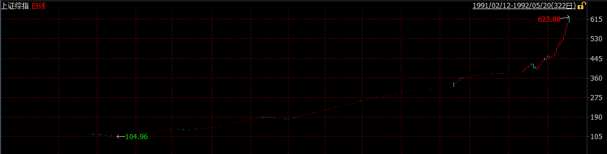
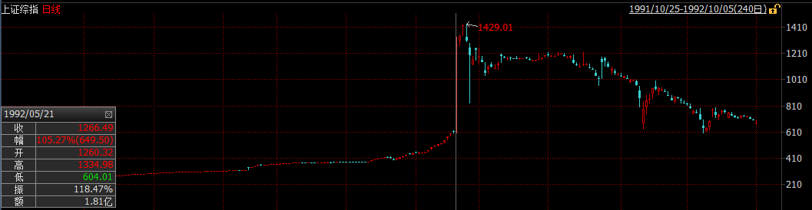
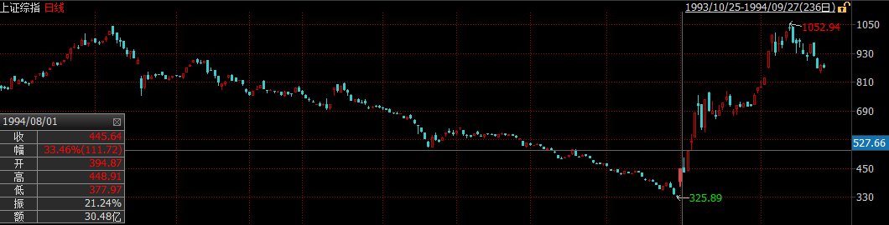
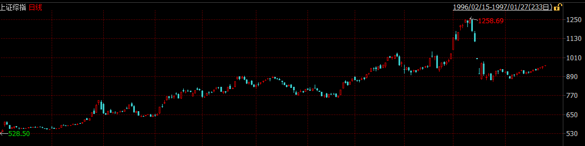
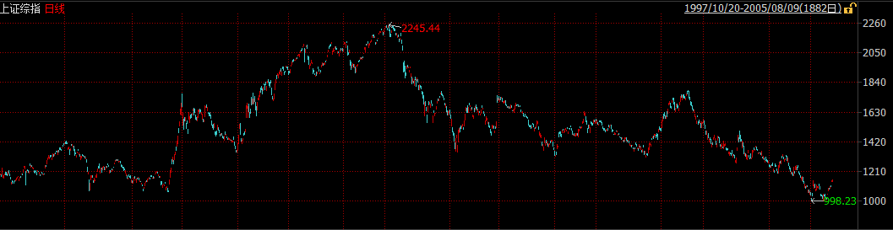
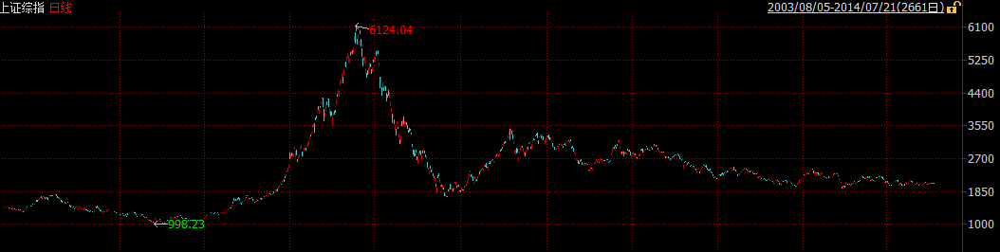

# 中國金融市場發展簡史

深圳證券交易所於1989年11月15日籌建，1990年12月1日鳴鑼開市，深安達（ST國農）成爲開業當天上市的唯一一家公司。與此同時，上海證券交易所於1990年11月26日由中國人民銀行總行批准成立，同年12月19日正式營業，首批上市的八家公司被稱爲「老八股」（飛樂音響、延中實業（方正科技）、愛使股份、真空電子、申華失業（華晨集團）、飛樂股份、豫園商城、浙江鳳凰）。

當時的社會對於這一究竟是「姓資」還是「姓社」猶豫不決，因而在最早的一批股票發行的時候。深發展和萬科等深交所上市的第一批股票在發行期無人問津，最終不得不號召黨員，甚至可以以折價的方式認購。1991年10月31日：首家B股深南玻B公開招股。這是中國股份制企業首次發行B股。1992年1月，一種叫「股票認購證」的票證首次出現在上海街頭，向市民發售，誰會想到，就是一張售價僅30元的認購證，改變了很多人一生的命運。股票認購證的發行象徵我國股份制改革的一個開端，證券市場從此進入了一個前所未有的高速增長期。

隨着鄧小平第二次南巡以及相關股票的價格不斷走高，越來越多人發現參與股票交易有利可圖。此外由於在早年階段交易所爲了控制風險，採取了嚴格的價格限制措施，日漲跌幅限制爲1%，這加劇了股票市場供不應求的局面。於是搶購新股，搶購認購證成爲了當時的常態，甚至在深圳發生了由於搶購新股引起的嚴重的踩踏事件，造成了不良的社會影響。1992年5月21日，上交所放開了僅有的15只上市股票的價格限制，引發股市暴漲。由於沒有漲停板限制，滬市一日漲了105％。隨後，股指連飈兩日，25日，行情觸頂，報1429點。

中國股市也正是從這一高點開始經歷了滑落近80％，近乎關市的最慘痛一次熊市。1994年7月30日、人民日報發表證監會與國務院有關部門共商穩定和發展股票市場的措施，俗稱「三大政策」（今年內暫停新股發行與上市，嚴格控制上市公司配股規模，擴大入市資金範圍），引起八月狂潮。

1995年1月3日，中國股市開始實行T＋1制度。1995年2月23日，是國債期貨市場開市以來行情變化最大，最激烈，形勢最險峻的一天。327品種異常波動，尾市空方大筆封殺，令市場目瞪口呆，措手不及。上交所宣佈，23日下午16時22分13秒以後的「327」品種的所有成交無效。該部分成交不計入當日成交量範圍之內。事後查明，327事件是由少數交易大戶蓄意違規，操縱市場，扭曲價格，嚴重擾亂市場秩序所引起的國債期貨風波。1995年8月，外資直接購買北旅股份法人股，揭開了外資併購的序幕。

1996年的股市走出了一輪大的上升行情，全年基本上走出了單邊上揚的走勢，直至年底的瘋漲，管理層的「十二道金牌」都沒能拉住瘋牛，直至人民日報的特約評論員文章出現，才拉住了瘋牛，大盤出現連續兩個跌停板，投資者重新趨於理智。

1997-2000年，由於中國經濟尚處於相對封閉階段，並未受到亞洲金融風暴的影響，加之經濟增速迅猛以及互聯網泡沫的刺激，中國股市繼續高歌猛進，在2001年達到頂點。然而公司治理問題逐漸突出，國有股減持引起的市場擔憂以及互聯網泡沫的破滅逐漸成爲新千年以來市場關注的焦點，中國股市也隨即陷入了曠日持久的4年熊市，從2001年的2245點直至2005年的998點，上證指數累計點去了55.45%。

股權分置問題被普遍認爲是困擾我國股市發展的頭號難題。由於歷史原因，我國股市上有三分之二的股權不能流通。由於同股不同權、同股不同利等「股權分置」存在的弊端，嚴重影響着股市的發展。2005年，《國務院關於推進資本市場改革開放和穩定發展的若干意見》明確指出應「積極穩妥解決股權分置問題」，提出「在解決這一問題時要尊重市場規律，有利於市場的穩定和發展，切實保護投資者特別是公衆投資者合法權益」的總體要求。這項政策刺激了低迷已久的中國股市，隨之而來的是中國股市歷史上最大的一波牛市，中國股市在短短兩年時間翻了6倍。好景不長，股權分置改革的負面效應開始逐漸顯現，非流通股的上市使得股票供給急劇增加，加之金融危機的衝擊，中國股市再次陷入漫漫熊途。

