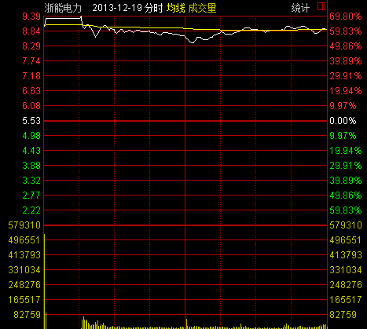
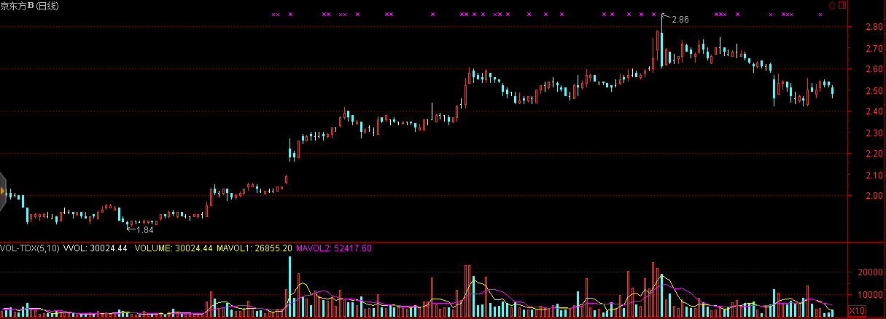

# 中國金融市場未來機遇

## 散戶化市場

中國金融市場的發展速度遠快於國外金融市場，這導致國民素質與金融市場的巨大脫節，對於金融市場理解不透徹，容易進入誤區，產生錯覺，進而導致非理性的投資決策。

中國證券市場的一大特點就是散戶化，雖然隨着近些年機構投資的大量介入散戶化程度呈下降態勢，但散戶的市場參與人數佔比仍然遠高於成熟市場平均水平。散戶化市場的表現形式有：

* 羊羣效應：導致價格趨勢性明顯強於成熟市場。
* 過分自信：導致頻繁交易，儘管散戶在中國市場中持有的市值僅有20%多一些，但卻貢獻了70%以上的交易量。

以及其他一系列行爲金融學中噪音交易者模型所表現出的特徵。

這些現象存在較多的套利機會，以跨市套利爲例，我們選擇分別在A股市場以及其他成熟市場（如H股、美股等）上市的股票作爲套利對象。當與之相關的新信息進入這個市場中時，反映不足的現象在散戶化程度較高的市場明顯強於成熟市場，因而可以通過在A股市場追趕趨勢，在成熟市場反響對衝實現套利。

這一現象在乳製品行業三聚氰胺風波，上海醫藥的財務造假傳聞等事件中均有所體現。

## 制度套利

在看到中國金融市場尚未達到成熟的同時，我們同時也要認識到，中國金融市場在制度建設的過程中存在着大量套利機會。在本節的前半部分，我們首先回顧已經發生的制度套利案例。

### 股權分置改革

所謂股權分置，是指A股市場上的上市公司的股份分爲流通股與非流通股。股東所持向社會公開發行的股份，且能在證券交易所上市交易，稱爲流通股；而公開發行前股份暫不上市交易，稱爲非流通股。由於中國證券市場早年扮演着爲國企改革服務的角色，這種同一上市公司股份分爲流通股和非流通股的股權分置狀況，爲中國內地證券市場所獨有。

利用股權分置改革套利主要分爲兩方面，即通過持有非流通股進行套利和持有流通股進行套利。在股權分置改革之前非流通股由於不能上市交易，其市場價值較流通股有着巨大的折價。因而通過早年以極低的價格低價獲取非流通股，等待股權分置改革上市流通後獲利正是富有遠見地看到了同股同權的本質，這即使是在補償了流通股東之後仍然獲利巨大。

與此同時，在股權分置改革之前以合理的價格購入流通股也能夠獲得利益。由於股改要求非流通股東以多種方式給予流通股東以補償，而且類似的補償並不會產生新增股份攤薄公司收益，因而流通股東借股權分置改革獲得了額外的來自非流通股東的利益。

我們再來看幾則未來即將發生或者正在發生的機會。

### 三板市場的建立

中國市場結構是一個倒金字塔，美國是一個正金字塔。美國紐交所有2300家掛牌公司，然後是納斯達克，有2500個，再往下是OTCBB和粉單市場，大致將近1萬家掛牌公司，再往下是一個灰色市場，有6萬個掛牌公司，儘管在這些市場上掛牌的公司與交易所上市的公司無法同日而語，但它們服務於低層次企業，實現了很好的分化。而中國正好相反，主板有1400家掛牌公司中小板是700個，創業板是355個，中關村代辦轉讓系統原來只有100多個，今年以來多了些，當然中國還有很多區域性產權交易所，但發展不太規範，良莠不齊。所以要加快三板和四板的市場建設，尤其是「新三板」。

2014年8月25日，新三版做市交易制度正式上線，這標誌着新三板交易的放開。根據以往經驗，在任何一個市場建立的初期往往存在着大量的無效以及套利機會。

### 信用定價體系的完善

2013年以前，中國的信用債市場奇蹟般地保持着「零違約」的記錄，這種在政府保護與監管下的扭曲導致信用基差被無限收窄，信用體系建設落後。隨着2014年幾例債券違約事件的出現以及信用體系的加緊建設，未來信用基差也將隨之擴大，信用定價體系的完善以及信用定價重估的過程將會帶來巨大的套利機會。

### 衍生品體系的建立

股指期貨，股指期權，個股期貨，個股期權的相繼建立將會爲市場提供豐富的對衝工具，至此我們介紹的諸如股票多空倉策略等在中國A股市場將會成爲可能。

### B股問題的解決

由於歷史原因，我國的B股市場一直是管理層手中一個燙手的山芋，流動性問題導致了B股價格較A股價格普遍折價50%。目前市場上仍然存在很大的價差和套利空間。

對於跨市套利如果無法實現證券的跨市轉讓則很難消除兩地差價，這在中國A股市場和B股市場之間也長期存在，然而國際板的推出將會伴隨B股歷史遺留問題的解決，目前處理B股問題的三種方式。

轉板至A股上市意味著所有B股的存續股都將轉換為A股股份，這將瞬間抹平A、B股之間的價差，然而轉板將會受到A股投資者強烈的反對而很難得以實施。目前唯有純B股上市公司東電B股(900949.SH)被浙能電力借殼並順利轉板。從上市首日60%的漲幅可以看出，一旦B股實現轉板將為投資者帶來巨額收益。

轉板至H股上市則為深圳B股提供了另一個解決途徑，這一方案的可行之處在於兩者交易的幣種同為港幣，而且轉板H股並不會為A股股票帶來額外的供給壓力，因而較為容易事實。截止2014年年底，共有3家深圳B股企業成功轉板，萬科B(200002.SZ)、中集B(200039.SZ)、麗珠B(200513.SZ)

回購註銷最終要約收購是最為直接的一種解決方式，主要由大股東出資從二級市場購回已發行的B股進行註銷，當存續B股少於一定數量時可以依照規則啟動要約收購程式，這一解決方式對大股東的資金實力提出了很高的要求，而且回購過程中如出現股價的大幅上升將會對最終回購效果產生很大的影響。長安汽車於2011年12月6日發佈《關於回購公司部分境內上市外資股（B股）股份的預案》，擬以公司自有資金公司以不高於 3.76 港元/股回購資金總額不超過 6.1 億港元及最多不超過 26,985.9 萬股 B 股。約占B股總股本的25.14%。受此消息影響，長安B複牌後3日股價上漲近30%，經過短暫調整後再度穩步上揚，使得公司的回購數量大幅低於預期。2012年3月31日，長安汽車發佈《關於回購部分境內上市外資股（B股）股份實施完畢及股份變動報告書》，公司累計回購B 股數量為171,596,438股，僅實現預期回購數量的63.5%

同樣的情況發生在京東方B(200725.SZ)，公司與2014年7月29日發佈回購公告後股價開盤即上升6%，隨後一路上揚最高至2.86港元/股，最高漲幅達36.84%，此時股價已遠高於回購區間上限，回購事項不得不擱置。

### 漲跌停板制度

我國證券市場現行的漲跌停板制度是1996年12月13日發佈，1996年12月26日開始實施的，旨在保護廣大投資者利益，保持市場穩定，進一步推進市場的規範化。制度規定，除上市首日之外，股票（含A、B股）、基金類證券在一個交易日內的交易價格相對上一交易日收市價格的漲跌幅度不得超過10％，超過漲跌限價的委託爲無效委託。

漲跌停板制度的限價措施使得股票價格走勢具有更強的趨勢型。通過對2010年1月1日-2013年12月31日的所有中國A股股票日內數據進行回測，我們發現所有11,013例當天收盤漲停但非「一字板」的股票第二天的期望漲幅爲1.7167%，所有3,389例當天收盤跌停但非「一字板」的股票第二天的期望漲幅爲-1.6508%

如果股票在收盤時並未封住漲停或者跌停，情況又有所變化。我們發現所有6765例當天漲停過但收盤未在漲停價位的案例第二天的期望漲幅爲-0.3561%，其中748例收盤漲幅在9%以上的股票第二天的期望漲幅爲-0.8441%。所有5034例當天跌停過但收盤未在跌停價位的案例第二天的期望漲幅爲0.0654%，其中1221例收盤跌幅在9%以上的股票第二天的期望漲幅爲0.0445%。

### T+1交易制度

自1995年1月1日起，爲了保證股票市場的穩定，防止過度投機，股市實行「T＋1」交易制度，當日買進的股票，要到下一個交易日才能賣出。這一制度給日內價格走勢帶來了嚴重的扭曲，但卻爲利用融資融券等渠道的套利提供了可能。
分級基金的錯誤定價

## 案例討論：中國分級基金定價研究與實證分析

此外，退市制度的完善與IPO發行制度完善等過程都將帶來難得的制度套利機遇。

### 案例討論 新股申購技巧
