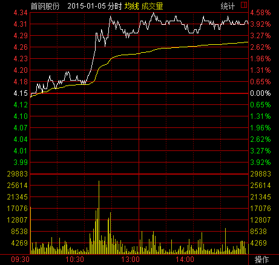
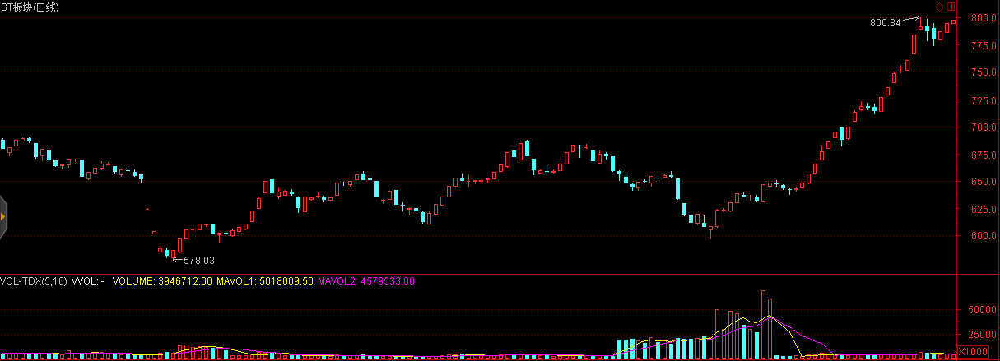

# 中國金融市場未來機遇

## 散戶化市場

中國金融市場的發展速度遠快於國外金融市場，這導致國民素質與金融市場的巨大脫節，對於金融市場理解不透徹，容易進入誤區，產生錯覺，進而導致非理性的投資決策。

中國證券市場的一大特點就是散戶化，雖然隨着近些年機構投資的大量介入散戶化程度呈下降態勢，但散戶的市場參與人數佔比仍然遠高於成熟市場平均水平。散戶化市場的表現形式有：

* 羊羣效應：導致價格趨勢性明顯強於成熟市場。
* 過分自信：導致頻繁交易，儘管散戶在中國市場中持有的市值僅有20%多一些，但卻貢獻了70%以上的交易量。

以及其他一系列行爲金融學中噪音交易者模型所表現出的特徵。

這些現象存在較多的套利機會，以跨市套利爲例，我們選擇分別在A股市場以及其他成熟市場（如H股、美股等）上市的股票作爲套利對象。當與之相關的新信息進入這個市場中時，反映不足的現象在散戶化程度較高的市場明顯強於成熟市場，因而可以通過在A股市場追趕趨勢，在成熟市場反響對衝實現套利。

這一現象在乳製品行業三聚氰胺風波，上海醫藥的財務造假傳聞等事件中均有所體現。

###證券市場中的名稱效應

在中國股票市場中，不僅好的題材能夠獲得投資者青睞，就連好的名稱也能夠獲得超額收益。
2012年8月22日，ST梅雁(600868.SH)摘帽後將梅雁股份更名為梅雁吉祥，這一“吉祥”為梅雁股份帶來了連續三個一字漲停，股價漲幅達33%

2012年11月7日上午，奧巴馬獲得了2012美國大選勝利，受此消息影響，新能源板塊有不錯的表現，然而最令人瞠目結舌的是，與之風馬牛不相及的奧馬電器(002668.SZ)僅因名稱相近也獲得了市場投資者的青睞，在大盤下跌的背景下下午沖高上升超過1%

奶茶與強哥的分手八卦居然使得天澤信息(300209.SZ)躺著中槍。其股價與新年伊始便觸及跌停。

首日開盤買首開股份(600376.SH)，這句話似乎在2015年再次得到了印證，其股價在2015年第一個交易日強勢漲停，緊隨其後的還有首創股份(600008.SH)和首鋼股份(000959.SZ)。

## 制度套利

在看到中國金融市場尚未達到成熟的同時，我們同時也要認識到，中國金融市場在制度建設的過程中存在着大量套利機會。在本節的前半部分，我們首先回顧已經發生的制度套利案例。

### 股權分置改革

所謂股權分置，是指A股市場上的上市公司的股份分爲流通股與非流通股。股東所持向社會公開發行的股份，且能在證券交易所上市交易，稱爲流通股；而公開發行前股份暫不上市交易，稱爲非流通股。由於中國證券市場早年扮演着爲國企改革服務的角色，這種同一上市公司股份分爲流通股和非流通股的股權分置狀況，爲中國內地證券市場所獨有。

利用股權分置改革套利主要分爲兩方面，即通過持有非流通股進行套利和持有流通股進行套利。在股權分置改革之前非流通股由於不能上市交易，其市場價值較流通股有着巨大的折價。因而通過早年以極低的價格低價獲取非流通股，等待股權分置改革上市流通後獲利正是富有遠見地看到了同股同權的本質，這即使是在補償了流通股東之後仍然獲利巨大。

與此同時，在股權分置改革之前以合理的價格購入流通股也能夠獲得利益。由於股改要求非流通股東以多種方式給予流通股東以補償，而且類似的補償並不會產生新增股份攤薄公司收益，因而流通股東借股權分置改革獲得了額外的來自非流通股東的利益。

我們再來看幾則未來即將發生或者正在發生的機會。

### 退市制度完善

中國股市目前正處在市場擴容期與建設期，加之新股發行的審核制，使得上市資源供不應求，借殼上市、資產重組成了待上市公司更為便捷的上市通道，這也使得主業受困的企業獲得了烏雞變鳳凰的機遇。這其中最經典的案例莫過於廣發證券借殼延邊公路了，從2006年10月19日停牌至2010年2月12日複牌，首日開盤411%的漲幅使投資者賺得盆滿缽滿。因而在2011年以前，重組預期、借殼預期使得這些公司享受了很大的估值溢價。然而與之相對立的是，借殼上市資產重組過程中存在的監管以及規則漏洞使得侵害投資者行為愈演愈烈，其中包括內幕交易、虛高資產價格、虛增企業收入等行為引起了監管部門的警覺，2011年8月，證監會發佈《關於修改上市公司重大資產重組與配套融資相關規定的決定》，而該項政策的核心是借殼重組與IPO趨同，大幅度提高了審核門檻。2012年7月29日滬深交易所發佈《關於完善上海證券交易所上市公司退市制度的方案(徵求意見稿)》和《關於改進和完善主機板、中小企業板上市公司退市制度的方案(徵求意見稿)》，退市新規大大增強了ST股退市風險，並對ST股日常交易進行嚴格限制，投資者單日買入單檔股票不得超過50萬股。受此影響，ST板塊遭遇重創。在2015年1月30日發佈的修訂版中，更強調主動退市公司申請重新上市受“優待”，完善退市整理期交易投資者適當性安排，將50萬以下資產的中小散戶拒之門外。

不過正是這般嚴格的退市政策使得絕處逢生的摘帽摘星股獲得了估值修復機遇，個股摘帽摘星後，退市風險與參與限制得意解除，這降低了股票短期的退市風險，並提升了股票的流動性，以2014年摘帽摘星股的表現看，摘帽前兩個月的漲幅驚人，不過隨著摘帽預期的落實，在摘帽當天普遍呈現沖高回落的態勢。

<table>
<tr>	<td>股票代碼</td>	<td>股票名稱</td>	<td>摘帽日期</td>	<td>摘帽前2個月漲幅</td>	<td>當日開盤漲幅</td>	<td>當日收盤漲幅</td>	</tr>
<tr>	<td>002047</td>	<td>*ST成霖</td>	<td>2014.1.13</td>	<td>0.0677</td>	<td>0</td>	<td>-0.0682</td>	</tr>
<tr>	<td>600538</td>	<td>*ST國發</td>	<td>2014.2.24</td>	<td>0.1489</td>	<td>-0.0248</td>	<td>-0.0833</td>	</tr>
<tr>	<td>600961</td>	<td>*ST株冶</td>	<td>2014.3.6</td>	<td>0.0954</td>	<td>0.023</td>	<td>0.0993</td>	</tr>
<tr>	<td>600760</td>	<td>*ST黑豹</td>	<td>2014.3.7</td>	<td>0.1202</td>	<td>0.1</td>	<td>0.1</td>	</tr>
<tr>	<td>600155</td>	<td>*ST寶碩</td>	<td>2014.3.10</td>	<td>0.3194</td>	<td>0.0852</td>	<td>0.1004</td>	</tr>
<tr>	<td>600603</td>	<td>*ST興業</td>	<td>2014.3.10</td>	<td>0.1863</td>	<td>0.0758</td>	<td>0.1005</td>	</tr>
<tr>	<td>000908</td>	<td>*ST天一</td>	<td>2014.3.11</td>	<td>0.4226</td>	<td>0.0268</td>	<td>0.0268</td>	</tr>
<tr>	<td>000018</td>	<td>*ST中冠A</td>	<td>2014.3.13</td>	<td>0.1402</td>	<td>0.0431</td>	<td>0.0049</td>	</tr>
<tr>	<td>600707</td>	<td>*ST彩虹</td>	<td>2014.3.14</td>	<td>0.1504</td>	<td>0</td>	<td>-0.0418</td>	</tr>
<tr>	<td>002161</td>	<td>*ST上控</td>	<td>2014.3.17</td>	<td>0.0642</td>	<td>0.0013</td>	<td>0.013</td>	</tr>
<tr>	<td>000555</td>	<td>*ST太光</td>	<td>2014.3.19</td>	<td>0.1726</td>	<td>0.0334</td>	<td>-0.0363</td>	</tr>
<tr>	<td>000717</td>	<td>*ST韶鋼</td>	<td>2014.3.24</td>	<td>0.1034</td>	<td>0.026</td>	<td>0</td>	</tr>
<tr>	<td>600617</td>	<td>*ST聯華</td>	<td>2014.3.25</td>	<td>0.0064</td>	<td>-0.0171</td>	<td>-0.1001</td>	</tr>
<tr>	<td>600980</td>	<td>*ST北磁</td>	<td>2014.3.26</td>	<td>0.1392</td>	<td>-0.0591</td>	<td>-0.007</td>	</tr>
<tr>	<td>000056</td>	<td>*ST國商</td>	<td>2014.3.31</td>	<td>-0.053</td>	<td>0.0154</td>	<td>-0.0769</td>	</tr>
<tr>	<td>002265</td>	<td>*ST西儀</td>	<td>2014.4.3</td>	<td>0.1737</td>	<td>0.0316</td>	<td>-0.0506</td>	</tr>
<tr>	<td>601919</td>	<td>*ST遠洋</td>	<td>2014.4.3</td>	<td>0.0857</td>	<td>-0.0056</td>	<td>-0.05</td>	</tr>
<tr>	<td>000958</td>	<td>*ST東熱</td>	<td>2014.4.3</td>	<td>0.5651</td>	<td>0.0368</td>	<td>-0.0534</td>	</tr>
<tr>	<td>600769</td>	<td>*ST祥龍</td>	<td>2014.4.4</td>	<td>0.1794</td>	<td>-0.0385</td>	<td>0.0018</td>	</tr>
<tr>	<td>000902</td>	<td>*ST中服</td>	<td>2014.4.10</td>	<td>0.0089</td>	<td>0.0242</td>	<td>-0.0135</td>	</tr>
<tr>	<td>000898</td>	<td>*ST鞍鋼</td>	<td>2014.4.10</td>	<td>0.113</td>	<td>-0.0034</td>	<td>0.1017</td>	</tr>
<tr>	<td>600234</td>	<td>*ST山水</td>	<td>2014.4.21</td>	<td>0.4107</td>	<td>0.0203</td>	<td>0.1</td>	</tr>
<tr>	<td>000035</td>	<td>*ST科健</td>	<td>2014.4.22</td>	<td>0.0324</td>	<td>0.0306</td>	<td>0.0891</td>	</tr>
<tr>	<td>000617</td>	<td>*ST濟柴</td>	<td>2014.4.23</td>	<td>0.0833</td>	<td>0.0193</td>	<td>-0.0277</td>	</tr>
<tr>	<td>600358</td>	<td>*ST聯合</td>	<td>2014.4.24</td>	<td>0.3808</td>	<td>0.0085</td>	<td>-0.0393</td>	</tr>
<tr>	<td>600579</td>	<td>*ST黃海</td>	<td>2014.4.29</td>	<td>0.1551</td>	<td>-0.1</td>	<td>-0.0743</td>	</tr>
<tr>	<td>600555</td>	<td>*ST九龍</td>	<td>2014.4.30</td>	<td>0.0929</td>	<td>-0.0174</td>	<td>-0.0087</td>	</tr>
<tr>	<td>600698</td>	<td>ST輕騎</td>	<td>2014.5.5</td>	<td>0.0831</td>	<td>-0.0108</td>	<td>-0.0994</td>	</tr>
<tr>	<td></td>	<td>平均</td>	<td></td>	<td>0.1589</td>	<td>0.0116</td>	<td>-0.0033</td>	</tr>

</table>

### 三板市場的建立

中國市場結構是一個倒金字塔，美國是一個正金字塔。美國紐交所有2300家掛牌公司，然後是納斯達克，有2500個，再往下是OTCBB和粉單市場，大致將近1萬家掛牌公司，再往下是一個灰色市場，有6萬個掛牌公司，儘管在這些市場上掛牌的公司與交易所上市的公司無法同日而語，但它們服務於低層次企業，實現了很好的分化。而中國正好相反，主板有1400家掛牌公司中小板是700個，創業板是355個，中關村代辦轉讓系統原來只有100多個，今年以來多了些，當然中國還有很多區域性產權交易所，但發展不太規範，良莠不齊。所以要加快三板和四板的市場建設，尤其是「新三板」。

2014年8月25日，新三版做市交易制度正式上線，這標誌着新三板交易的放開。根據以往經驗，在任何一個市場建立的初期往往存在着大量的無效以及套利機會。

### 信用定價體系的完善

2013年以前，中國的信用債市場奇蹟般地保持着「零違約」的記錄，這種在政府保護與監管下的扭曲導致信用基差被無限收窄，信用體系建設落後。隨着2014年幾例債券違約事件的出現以及信用體系的加緊建設，未來信用基差也將隨之擴大，信用定價體系的完善以及信用定價重估的過程將會帶來巨大的套利機會。

### 衍生品體系的建立

股指期貨，股指期權，個股期貨，個股期權的相繼建立將會爲市場提供豐富的對衝工具，至此我們介紹的諸如股票多空倉策略等在中國A股市場將會成爲可能。

### B股問題的解決

由於歷史原因，我國的B股市場一直是管理層手中一個燙手的山芋，流動性問題導致了B股價格較A股價格普遍折價50%。目前市場上仍然存在很大的價差和套利空間。

對於跨市套利如果無法實現證券的跨市轉讓則很難消除兩地差價，這在中國A股市場和B股市場之間也長期存在，然而國際板的推出將會伴隨B股歷史遺留問題的解決，目前處理B股問題的三種方式。

轉板至A股上市意味著所有B股的存續股都將轉換為A股股份，這將瞬間抹平A、B股之間的價差，然而轉板將會受到A股投資者強烈的反對而很難得以實施。目前唯有純B股上市公司東電B股(900949.SH)被浙能電力借殼並順利轉板。從上市首日60%的漲幅可以看出，一旦B股實現轉板將為投資者帶來巨額收益。

轉板至H股上市則為深圳B股提供了另一個解決途徑，這一方案的可行之處在於兩者交易的幣種同為港幣，而且轉板H股並不會為A股股票帶來額外的供給壓力，因而較為容易事實。截止2014年年底，共有3家深圳B股企業成功轉板，萬科B(200002.SZ)、中集B(200039.SZ)、麗珠B(200513.SZ)

回購註銷最終要約收購是最為直接的一種解決方式，主要由大股東出資從二級市場購回已發行的B股進行註銷，當存續B股少於一定數量時可以依照規則啟動要約收購程式，這一解決方式對大股東的資金實力提出了很高的要求，而且回購過程中如出現股價的大幅上升將會對最終回購效果產生很大的影響。長安汽車於2011年12月6日發佈《關於回購公司部分境內上市外資股（B股）股份的預案》，擬以公司自有資金公司以不高於 3.76 港元/股回購資金總額不超過 6.1 億港元及最多不超過 26,985.9 萬股 B 股。約占B股總股本的25.14%。受此消息影響，長安B複牌後3日股價上漲近30%，經過短暫調整後再度穩步上揚，使得公司的回購數量大幅低於預期。2012年3月31日，長安汽車發佈《關於回購部分境內上市外資股（B股）股份實施完畢及股份變動報告書》，公司累計回購B 股數量為171,596,438股，僅實現預期回購數量的63.5%

同樣的情況發生在京東方B(200725.SZ)，公司與2014年7月29日發佈回購公告後股價開盤即上升6%，隨後一路上揚最高至2.86港元/股，最高漲幅達36.84%，此時股價已遠高於回購區間上限，回購事項不得不擱置。

### 漲跌停板制度

我國證券市場現行的漲跌停板制度是1996年12月13日發佈，1996年12月26日開始實施的，旨在保護廣大投資者利益，保持市場穩定，進一步推進市場的規範化。制度規定，除上市首日之外，股票（含A、B股）、基金類證券在一個交易日內的交易價格相對上一交易日收市價格的漲跌幅度不得超過10％，超過漲跌限價的委託爲無效委託。

漲跌停板制度的限價措施使得股票價格走勢具有更強的趨勢型。通過對2010年1月1日-2013年12月31日的所有中國A股股票日內數據進行回測，我們發現所有11,013例當天收盤漲停但非「一字板」的股票第二天的期望漲幅爲1.7167%，所有3,389例當天收盤跌停但非「一字板」的股票第二天的期望漲幅爲-1.6508%

如果股票在收盤時並未封住漲停或者跌停，情況又有所變化。我們發現所有6765例當天漲停過但收盤未在漲停價位的案例第二天的期望漲幅爲-0.3561%，其中748例收盤漲幅在9%以上的股票第二天的期望漲幅爲-0.8441%。所有5034例當天跌停過但收盤未在跌停價位的案例第二天的期望漲幅爲0.0654%，其中1221例收盤跌幅在9%以上的股票第二天的期望漲幅爲0.0445%。

### T+1交易制度

自1995年1月1日起，爲了保證股票市場的穩定，防止過度投機，股市實行「T＋1」交易制度，當日買進的股票，要到下一個交易日才能賣出。這一制度給日內價格走勢帶來了嚴重的扭曲，但卻爲利用融資融券等渠道的套利提供了可能。

### 封闭式基金

封閉式基金是指基金規模在發行前已確定、在發行完畢後的規定期限內固定不變並在證券市場上交易的投資基金。上世紀90年代中國基金行業興起了第一輪基金擴張潮，但過快的擴張速度為基金的統一監管帶來了較大的困難。1993年9月至1998年上半年，未再批准設立過各類基金，國內基金的發行陷入停滯狀態。隨著監管條例的明晰以及各大基金公司的相繼成立，封閉式基金在類似產品供給相對匱乏的年代取得了蓬勃發展，成立了54只封閉式基金，籌資總額達807億元。

由於封閉式基金規模確定，在封閉期無法進行申購與贖回，只能在二級市場交易，因而交易價格受當時市場供求關係的限制，當交易價格偏離淨值時，沒有合適的套利機制能夠對交易價格進行糾偏。從2000年開始，基金市場的擴容以及互聯網泡沫的破滅使封閉式基金處於普遍的折價狀態，投資者發現按照淨值認購新發行的封閉式基金不如在二級市場以折價購買存量基金份額。2002年9月後至今，沒有一隻傳統封閉式基金在投資基金市場發行。有些基金雖然名義上發行成功，實則大部分被承銷商包銷。基金科瑞高達4.39億份（銀豐也有1.3億份）的餘額被主承銷商包銷。基金久嘉拜大盤反彈之賜發行還算順利，但由於原發起人之一的新疆證券突然退出，被迫延遲40天上市。小盤改制基金的擴募情況也相當糟糕，如基金景業、基金天華、基金安久、基金融鑫的棄配率分別高達98.47%、90.4%、94.44%、95.27%。曾經風光無限的小盤基金擴募遭到了市場的遺棄。

然而封閉式基金在封閉期不受申購贖回的干擾，規模保持穩定，也就意味著基金經理可支配資金不受上一期業績影響，這就彌補了套利者的一大弱點，也就更容易執行一些高回報低風險的穩健回報策略。通過回測過去一段時間的淨值表現可以發現，封閉式基金的平均收益高於開放式基金。

雖然在基金封閉期，即使基金交易價格折價也無法通過淨值贖回進行套利，然而一旦封閉期結束，這些基金將轉為開放式基金，這就為折價套利提供了可行性，因而可以預見隨著封閉期到期日的臨近，二級市場交易價格將逐漸收斂到基金淨值。對於封閉期還剩5年折價率20%的封閉式基金而言，如果扣除管理費、託管費等各項費用1.8%/年，則相當於聘請了一個免費的專業管理者，還獲得了2.5%/年的折價回歸。

對於以來管理費用的基金公司而言，現金分紅會使得基金公司管理的資產減少，所以管理費減少，因而基金經理對於分紅並沒有激勵。基金法為封閉式基金的持有人提供了一個分紅的法律保護，在一個年度內封閉式基金的已實現淨收益的90%以上必須用於分紅，基金法為封閉式基金的持有人提供了一個分紅的法律保護，那就是說，一個年度內，封閉式基金的已實現淨收益的90%以上必須用於分紅。

由於在2001年-2005年市場整體處於下跌過程中，封閉式基金無紅可分，這一分紅條款逐漸被投資者淡忘。2006-2007年市場峰迴路轉，封閉式基金淨值也顯著提升，不少基金淨值超過2元，在保持一定股票換手率的前提下，這部分基金已經觸發分紅條款。假設在分紅日之前基金淨值為2元，二級市場的折價率為20%，即交易價格為1.6元。該基金每份分紅1元，則分紅之後，基金淨值為1元，按照20%的折價率算，交易價格為0.8元，而投資者的實際持有成本在分紅後僅為0.6元，上述套利空間對於僅有幾天的市場波動風險而言是相當可觀的，因而封閉式基金在分紅前普遍會產生一波“分紅行情”。

2007年，沉寂五年之久的封閉式基金市場迎來了新鮮血液，以大成優選和建信優勢為代表的創新型封閉式基金成為市場焦點。這類基金除了在基金條款上基本繼承了封閉式基金外，還派生出了許多創新條款，如更短的封閉期，更靈活的封閉政策等，使得這類基金的銷售一度處於火爆狀態。大成優選(150002)的“救生艇”條款設定，如果大成優選的折價率連續50個交易日在20%以上，該基金公司將召開持有人大會，審議提前封轉開的有關事宜。2009年2月16日到2009年4月13日，大成優選已經連續40個交易日折價率在20%以上，然而2009年4月14日，大成優選的折價率降到了19.88%，條款無法觸發。建信優勢(150003)也約定只要在基金生效滿一年後連續六十個交易日折價率超過15%，就將召開基金持有人大會，審議將基金轉為LOF基金的相關事宜。從2009年6月26日到2009年9月15日，建信優勢動力連續58個交易日折價率高於15%，2009年9月16日，建信優勢動力在沖高0.726元後回落，最終以0.720元收盤。當日晚間約七時許建信基金網站公佈當日該基金淨值0.847元，計算出當日該基金折價率約為14.99%，事實上在預期封轉開臨近時，由於折價套利空間很大，這些基金在二級市場上會吸引套利資金的進場，從而抬高二級市場交易價格，這也會導致折價率收窄，進而導致封轉開條款無法觸發。

當進行封閉式基金套利時，對於快到期的封閉式基金套利計算應該更加精確，除了考慮折價因素外還應密切關注贖回、時間成本以及市場波動。以2014年到期的基金漢興與基金景福為例，這兩檔基金在封閉期結束後均有15-30天的封轉開過渡期，基金持有者除了要承受期間的市場波動外，還需承擔0.5%的贖回費用以及過渡期資金佔用的時間成本。

### 分級基金的錯誤定價

### 案例討論：中國分級基金定價研究與實證分析

此外，退市制度的完善與IPO發行制度完善等過程都將帶來難得的制度套利機遇。

### 案例討論 新股申購技巧
